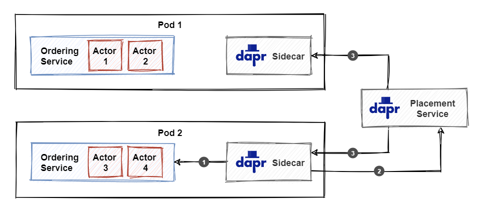

# The Dapr actors building block

The actor model originated in 1973. It was proposed by Carl Hewitt as a conceptual model of concurrent computation, a form of computing in which several computations are executed at the same time. Highly parallel computers weren't yet available at that time, but the more recent advancements of multi-core CPUs and distributed systems have made the actor model popular.

In the actor model, the *actor* is an independent unit of compute and state. Actors are completely isolated from each other and they will never share memory. Actors communicate with each other using messages. When an actor receives a message, it can change its internal state, and send messages to other (possibly new) actors.

The reason why the actor model makes writing concurrent systems easier is that it provides a turn-based (or single-threaded) access model. Multiple actors can run at the same time, but each actor will process received messages one at a time. This means that you can be sure that at most one thread is active inside an actor at any time. Therefore, there is no need for any synchronization mechanisms (like locks) for data access.

## What it solves

Actor model implementations are usually tied to a specific language or platform. With the Dapr actors building block however, you can leverage the actor model from any language or platform.

Dapr's implementation is based on the [Virtual Actor pattern](https://www.microsoft.com/en-us/research/project/orleans-virtual-actors/?from=https%3A%2F%2Fresearch.microsoft.com%2Fen-us%2Fprojects%2Forleans%2F), originally introduced by Project "Orleans". With the Virtual Actor pattern, you don't need to explicitly create actors. Actors are automatically activated and placed on a node in the cluster the first time a message is sent to the actor. When a node fails, Dapr automatically moves activated actors to healthy nodes.

While the actor model can provide great benefits, it's important to carefully consider the actor design. For example, having many clients call the same actor will result in poor performance because the actor cannot process more than one request at a time. The Dapr documentation provides a number of scenarios where the actor model is a good fit:

- Your problem space involves a large number (thousands or more) of small, independent, and isolated units of state and logic.
- You want to work with single-threaded objects that do not require significant interaction from external components, including querying state across a set of actors.
- Your actor instances won't block callers with unpredictable delays by issuing I/O operations.

## How it works

The Dapr sidecar provides the HTTP/gRPC API to invoke actors. This is the base URL of the HTTP API:

```http
http://localhost:<daprPort>/v1.0/actors/<actorType>/<actorId>/
```

- `<daprPort>`: the HTTP port that Dapr listens on.
- `<actorType>`: the actor type.
- `<actorId>`: the ID of the specific actor to call.

The sidecar manages how, when and where each actor runs, and also routes messages between actors. When an actor hasn't been used for a period of time, the runtime deactivates the actor and removes it from memory. Any state managed by the actor is persisted and will be available when the actor re-activates.

The sidecar API is only one part of the equation. The service itself also needs to implement an API specification, because the actual actor code will be running inside the service. Figure 11-1 shows the various API calls between the service and its sidecar:


**Figure 11-1**. API calls between actor service and Dapr sidecar.

To provide scalability and reliability, actors are partitioned across all the instances of the actor service. The Dapr placement service is responsible for keeping track of the partitioning information. When a new instance of an actor service is started, the sidecar registers the supported actor types with the placement service. The placement service calculates the updated partitioning information for the given actor type and broadcasts it to all instances. Figure 11-2 shows what happens when a service is scaled out to a second replica:



**Figure 11-2**. Actor placement service.

1. On startup, the sidecar makes a call to the actor service to get the registered actor types as well as actor configuration settings.
2. The sidecar sends the list of registered actor types to the placement service.
3. The placement service broadcasts the updated partitioning information to all actor service instances. Each instance will keep a cached copy of the partitioning information and use it to invoke actors.

> [!IMPORTANT]
> Because actors are randomly distributed across service instances, it should be expected that an actor operation always requires a call to a different node in the network.

The next figure shows an ordering service calling the `ship` method of an `OrderActor` instance with ID `3`:


**Figure 11-3**. Calling an actor method.

1. The service calls the actor API on the sidecar. The JSON payload in the request body contains the data to send to the actor.
2. The sidecar uses the locally cached partitioning information from the placement service to determine which actor service instance (partition) is responsible for hosting the actor with ID `3`. In this example, it's the service instance in pod 2. The call is forwarded to the appropriate sidecar.
3. The sidecar instance in pod 2 calls the service instance to invoke the actor. The service instance is responsible for activating the actor and executing the actor method.

### Timers and reminders


### Turn-based access model


### State persistence

Actor state is persisted using the Dapr [state management building block](./ch5-state-management.md). Because actors can execute multiple state operations in a single turn, the state store component must support multi-item transactions. At the time of writing, the following state stores are supported:

- Azure CosmosDB
- MongoDB
- PostgreSQL
- Redis
- SQL Server

To configure a state store component for use with actors, you need to append the following metadata to the state store configuration:

```yaml
- name: actorStateStore
  value: "true"
```

Here's a complete example for a Redis state store:

```yaml
apiVersion: dapr.io/v1alpha1
kind: Component
metadata:
  name: statestore
spec:
  type: state.redis
  version: v1
  metadata:
  - name: redisHost
    value: localhost:6379
  - name: redisPassword
    value: ""
  - name: actorStateStore
    value: "true"
```

## Using .NET SDK

You can create an actor model implementation using only HTTP/gRPC calls. However, it's much more convenient to use the language specific Dapr SDKs. At the time of writing, both the .NET and Java SDKs provide extensive support for working with actors.


## Reference architecture: eShopOnDapr


## Summary


### References

- [Dapr supported state stores](https://docs.dapr.io/operations/components/setup-state-store/supported-state-stores/)

>[!div class="step-by-step"]
>[Previous](index.md)
>[Next](index.md)
