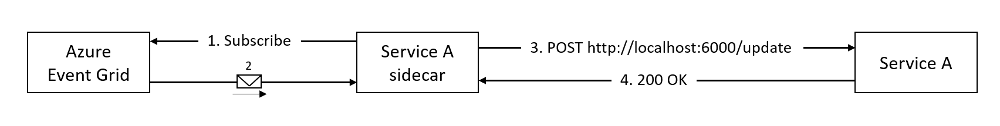
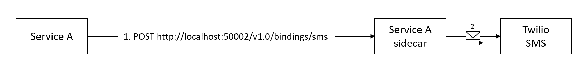

# The Resource bindings building block

On of the appeals of the highly popular serverless offerings by the different cloud vendors is its reactive nature. Messages come in from all sorts of different systems that trigger certain business logic. This business logic will often yield new messages that it subsequently needs to publish using another messaging system.

Dapr supports building applications that use different inputs and outputs with resource bindings.

## What it solves

You might think that the reactive behavior described in the introduction seems similar to the Publish/Subscribe pattern we described in [chapter 5](publish-subscribe-buildingblock.md). Although there are similarities, there are also some significant differences between the two.

Resource bindings offer a way to connect to different inputs and outputs without using any specific library or SDK in your application code. They also support more message sources and targets than the Publish/Subscribe building block (that primarily focuses on message brokers). For instance, an input binding exists for triggering an application when a tweet with a certain term in the text is published on Twitter. Also an output binding exists for sending an SMS using Twilio. Finally, an application can switch between bindings at runtime without any code changes, which is much harder to do with the Publish/Subscribe building block [TODO:CHALLENGE!!!].

The main focus of Dapr resource bindings is to make developers more productive by removing the hassle of learning specific APIs or SDKs for integrating with all sorts of different messaging systems.

## How it works

As stated, you don't need an SDK or library to use resource bindings. The Dapr sidecar will use input bindings to trigger your application by invoking a public HTTP endpoint that you provide. You trigger output bindings from your application by calling an API on the Dapr sidecar - either using HTTP or gRPC. Let's dive in.

### Input bindings

When you configure an input binding for your application, you basically couple a public HTTP endpoint that your application provides to a particular external trigger. Here is an example:



> In the example, the application handles HTTP calls on port 6000.

1. The Dapr sidecar picks up the binding configuration and subscribes to changes in the configured event source. In the example, the event source is an Azure Event Grid.
2. When an event is published to the Event Grid, the Dapr sidecar consumes it.
3. The Dapr sidecar invokes the configured endpoint on your application. In the example, this is an HTTP POST on the `/update` endpoint of the application. Because it is an HTTP POST, also the payload of the event is passed in.
4. After handling the trigger, your application returns an HTTP status code `200 OK`.

An alternative scenario is that something goes wrong while your application is handling the trigger. In that case, you can return an HTTP status code other than `200 OK` (for instance `500 Error`). If the binding offers at least once delivery guarantees, the Dapr sidecar will retry the trigger when that happens. Check out [the documentation of the different bindings](https://github.com/dapr/docs/tree/master/concepts/bindings) to see whether they offer at least once or exactly once delivery guarantees.

We will get back to how to configure bindings when we explain binding components.

### Output bindings

When you configure an output binding for your application, you can use it by invoking the bindings API on the Dapr sidecar of your application. Here is an example:



> In the example, the Dapr sidecar is configured to handle HTTP calls on port 50002.

1. Your application invokes the `/v1.0/bindings/sms` endpoint on the Dapr sidecar. In this case, it uses an HTTP POST to invoke the API. It is also possible to use gRPC.
2. The Dapr sidecar calls the external messaging system to send the message. The message will contain the payload of the HTTP call.

Here is an example of using the output binding from .NET:

```c#
private async Task SendSMSAsync(IHttpClientFactory clientFactory)
{
    var payload = new
    {
        data = new {
            subject = "Welcome!",
            message = "Welcome to this awesome service"
        },
        operation = "create"
    };

    // send message using output-binding
    var content = new StringContent(
        JsonSerializer.Serialize(payload),
        Encoding.UTF8, "application/json");

    var httpClient = clientFactory.CreateClient();

    await httpClient.PostAsync("http://localhost:50002/v1.0/bindings/sms", content);
}
```

As you can see in the example, the code uses no specific library or SDK. Just a plain `HttpClient` to do an HTTP POST.

### Components


### Configuring Bindings

## Reference case: eShopOnDapr

## Summary

### References

>[!div class="step-by-step"]
>[Previous](index.md)
>[Next](index.md)