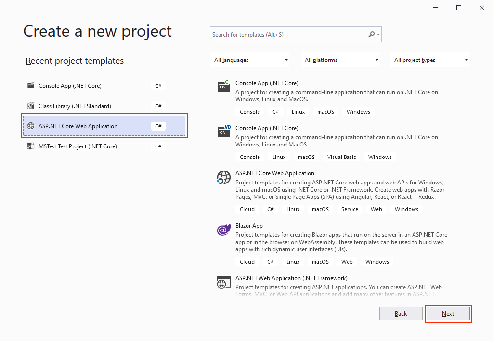
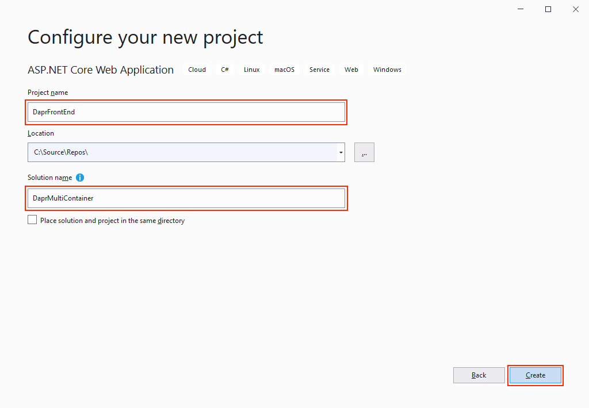
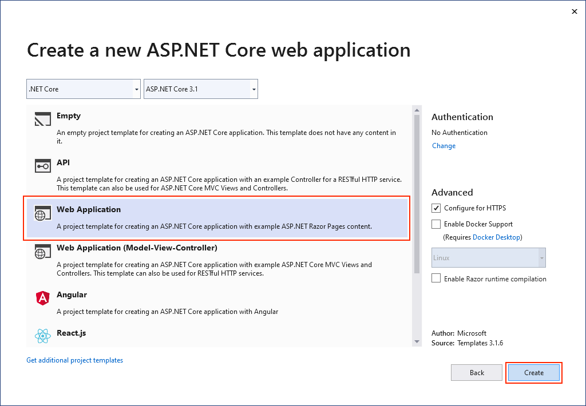
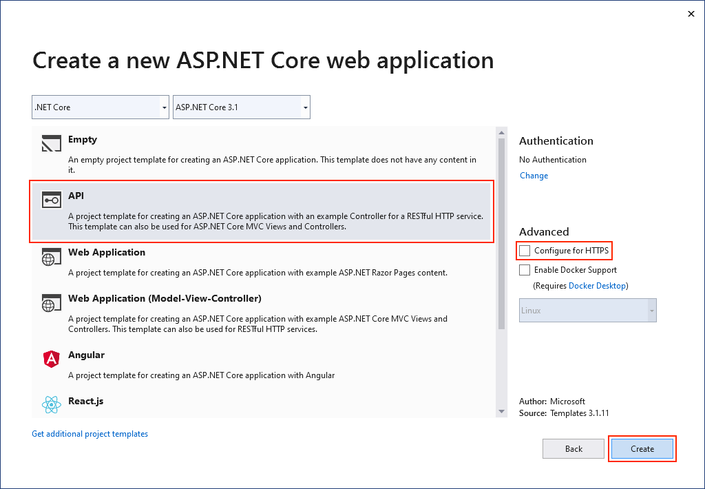
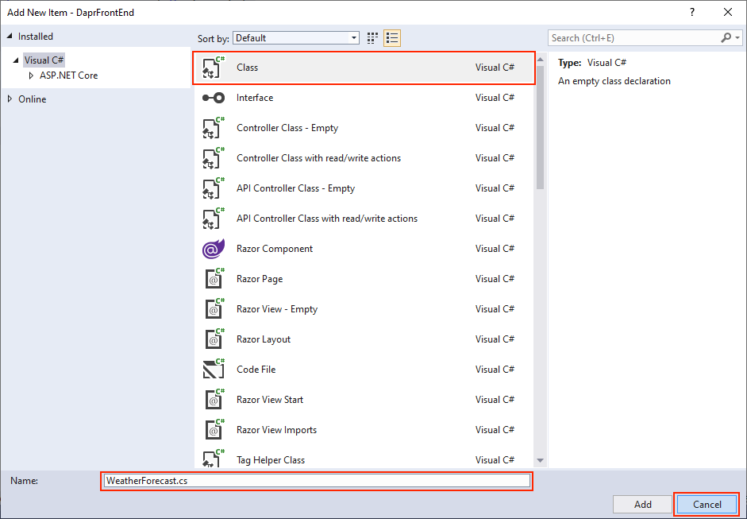
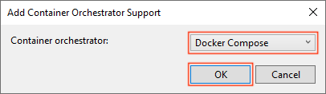
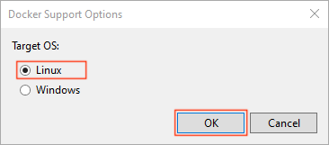
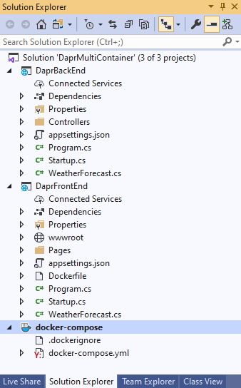
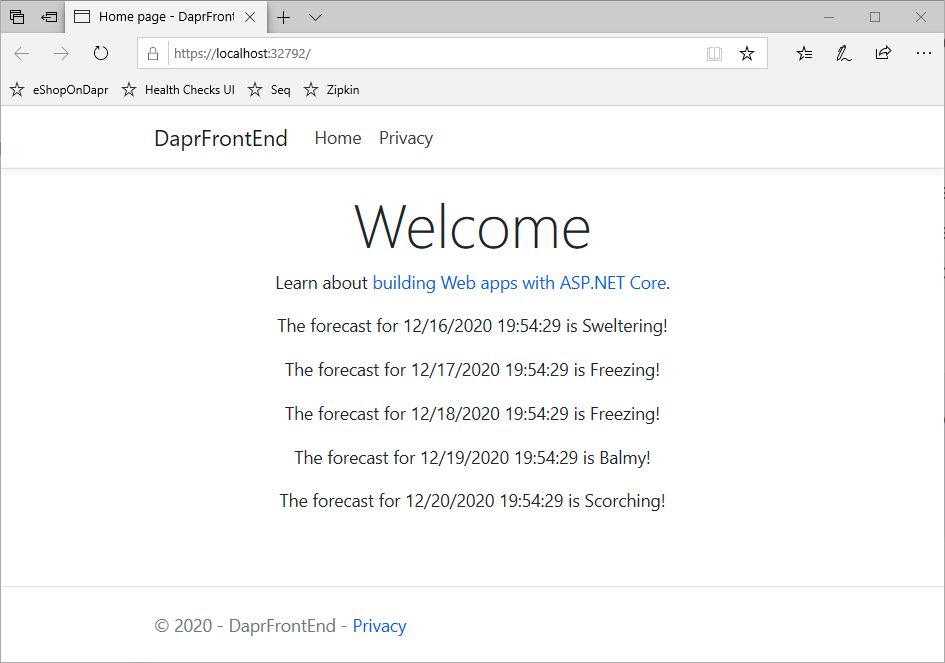

# Getting started with Dapr

In the first two chapters, you learned basic concepts about Dapr. It's time to take it for a *test drive*. This chapter will guide you through preparing your local development environment and building two Dapr .NET applications.

## Installing Dapr into your local environment

You'll start by installing Dapr on your development computer. Once complete, you can build and run Dapr applications in [self-hosted mode](https://docs.dapr.io/operations/hosting/self-hosted/self-hosted-overview/).

1. [Install the Dapr CLI](https://docs.dapr.io/getting-started/install-dapr-cli/). It enables you to launch, run, and manage Dapr instance. It also provides debugging support.

2. Install [Docker Desktop](https://docs.docker.com/get-docker/). If you're running on Windows, make sure that **Docker Desktop for Windows** is [configured to use Linux containers](https://docs.docker.com/docker-for-windows/#switch-between-windows-and-linux-containers).

  > [!NOTE]
  > By default, Dapr uses Docker containers to provide you the best out-of-the-box experience. To run Dapr outside of Docker, you can skip this step and [execute a *slim* initialization](https://docs.dapr.io/operations/hosting/self-hosted/self-hosted-no-docker/). The examples in this chapter require you use Docker containers.

3. [Initialize Dapr](https://docs.dapr.io/getting-started/install-dapr/). This step sets up your development environment by installing the latest Dapr binaries and container images.

4. Install the [.NET Core 3 Development Tools](https://dotnet.microsoft.com/download/dotnet-core/3.1) for .NET Core 3.1.

Now that Dapr is installed, it's time to build your first Dapr application!

## Building your first Dapr application

You'll start by building a simple .NET Console application that consumes the [Dapr State Management](../ch5-state-management.md) building block.

### Create the application

1. Open up the command shell or terminal of your choice. You might consider the terminal in [Visual Studio Code](https://code.visualstudio.com/). Navigate to the root folder in which you want to build your application. Once there, enter the following command to create a new .NET Console application:

   ```terminal
   ~$ dotnet new console -o DaprCounter
   ```

   The command scaffolds a simple "Hello World" .NET Core application.  

2. Then, navigate into the new directory created by the previous command:

   ```terminal
   ~$ cd DaprCounter
   ```

3. Run the newly created application using the the `dotnet run` command. Doing so writes "Hello World!" to the console screen:

   ```terminal
   ~$ dotnet run
   Hello World!
   ```

### Add Dapr State Management

Next, you'll use the Dapr [State Management building block](https://docs.dapr.io/developing-applications/building-blocks/state-management/state-management-overview/) to implement a stateful counter in the program.

You can invoke Dapr APIs across any platform with its native HTTP and gRPC SDKs. However, .NET Developers will find the Dapr .NET SDK more natural and intuitive. It provides a strongly typed .NET client to call the Dapr APIs. The .NET SDK tightly integrates with ASP.NET Core integrating Dapr features such as pub/sub messaging and state management.

1. From the terminal window, add the `Dapr.Client` NuGet package to your application:

   ```
   ~$ dotnet add package Dapr.Client
   ```

   > If you're working with a pre-release version of Dapr, be sure to add the `--prerelease` flag to the command.

2. Open the `Program.cs` file in your favorite editor and update its contents to the following code:

   ```c#
   using System;
   using System.Threading.Tasks;
   using Dapr;
   using Dapr.Client;
   
   namespace DaprCounter
   {
       class Program
       {
           static async Task Main(string[] args)
           {
               DaprClient daprClient = new DaprClientBuilder().Build();
   
               int counter = await daprClient.GetStateAsync<int>("statestore", "counter");
   
               while (true)
               {
                   Console.WriteLine($"Counter = {counter++}");
   
                   await daprClient.SaveStateAsync("statestore", "counter", counter);
   
                   await Task.Delay(1000);
               }
           }
       }
   }
   ```

   The updated code performs the following steps:

   - First a new `DaprClient` instance is instantiated. This class enables you to interact with most Dapr sidecars.
   - From the state store, `DaprClient.GetStateAsync` fetches the value for the `counter` key. If the key does exist, the default `int` value (which is `0`) is returned.
   - The code then iterates, writing the `counter` value to the console and saving an incremented value to the state store.

3. The Dapr CLI `run` command starts the application. It invokes the underlying Dapr runtime and enables the application and Dapr sidecar to run together. If you omit the `app-id`, Dapr will then generate a unique name for the application. 

 > [!IMPORTANT]
 > Care must be taken to always pass an explicit `app-id` parameter when consuming the State Management building block. The block uses the application Id value as a *prefix* for its state key for each key-value pair. If the application id changes, you can no longer access the previous stored state. 

   Run the application with the following command:

   ```
   ~$ dapr run --app-id DaprCounter dotnet run
   ```

   Try stopping and restarting the application. You'll see that the counter doesn't reset. Instead it continues from the previously saved state. The Dapr building block makes the application stateful.

You might wonder, where is the state stored? 

## Component configuration files

When you first initialized Dapr (`dapr init`) for your local environment, it automatically provisioned a Redis container. To expose the Redis container as the default state store component, Dapr also created a component configuration file, entitled `statestore.yaml`. Here's a look at its contents:

```yaml
apiVersion: dapr.io/v1alpha1
kind: Component
metadata:
  name: statestore
spec:
  type: state.redis
  metadata:
  - name: redisHost
    value: localhost:6379
  - name: redisPassword
    value: ""
  - name: actorStateStore
    value: "true"
```

 > [!NOTE]
 > Default component configuration files are stored in the `$HOME/.dapr/components` folder on Linux/macOS, and in the `%USERPROFILE%\.dapr\components` folder on Windows.

Note the format of the previous component configuration file:

- Each component has a name. In the sample above, the component is named `statestore`. We used that name in our first code example to tell the Dapr sidecar which component to use. 
- Each component configuration file has a `spec` section. It contains a `type` field that specifies the component type. The `metadata` field contains information that the component requires, such as connection details and other settings. The exact metadata values you need to specify vary per component.

By default, any Dapr sidecar can consume any component you've configured. In some scenarios, however, you may have an architectural justification to limit the access of a particular Dapr component. For example, you may want to restrict the accessibility of the previously shown Redis component to sidecars only running in a production environment. To do so, you can define a `namespace` for the production environment. Maybe you name it `production`. In self-hosted mode, you specify the namespace of a Dapr sidecar by setting the `NAMESPACE` environment variable. When configured, the Dapr sidecar will only load the components that match the namespace. For Kubernetes deployments, the Kubernetes namespace determines the components that are loaded. The following sample shows the Redis component placed in a `production` namespace. Note the `namespace` declaration in the `metadata` element:

```yaml
apiVersion: dapr.io/v1alpha1
kind: Component
metadata:
  name: statestore
  namespace: production
spec:
  type: state.redis
  metadata:
  - name: redisHost
    value: localhost:6379
  - name: redisPassword
    value: ""
  - name: actorStateStore
    value: "true"
```

If needed, you can restrict component usage further to a particular application. Within the `production` namespace, you may want to limit access of the Redis cache to only the `DaprCounter` application. You do so by specifying `scopes` in the component configuration. The following example shows how to restrict access to the Redis `statestore` component to the application `DaprCounter` in the `production` namespace:

```yaml
apiVersion: dapr.io/v1alpha1
kind: Component
metadata:
  name: statestore
  namespace: production
spec:
  type: state.redis
  metadata:
  - name: redisHost
    value: localhost:6379
  - name: redisPassword
    value: ""
  - name: actorStateStore
    value: "true"
  scopes:
  - DaprCounter
```

## Building a multi-container Dapr application

In the first walkthrough, we explained how you can create a simple application consisting of a single executable running side by side with a Dapr sidecar. Distributed applications such as eShopOnDapr consist of many more parts. eShopOnDapr has many .NET Core services running in containers along with containers for infrastructure such as Redis, SQL Server, Seq, and Zipkin. Managing multiple containers requires container orchestration and requires an orchestrator such as Docker Compose or Kubernetes. To make debugging and testing locally easy, we use Docker Compose in eShopOnDapr.

In the following walkthrough, you'll create a multi-container application from scratch and use Dapr Service Invocation to communicate between the services. The solution will consist of a front-end web application that retrieves weather forecasts from a back-end web API. The front-end and back-end will each run in a Docker container. To complete this walkthrough, you'll need to have installed Dapr into your local environment along with the following prerequisites:

- [Visual Studio 2019](https://visualstudio.microsoft.com/downloads) with the **.NET Core cross-platform development** workload installed
- [.NET Core 3 Development Tools](https://dotnet.microsoft.com/download/dotnet-core/3.1) for development with .NET Core 3.

### Create the application

1. In Visual Studio, create an **ASP.NET Core Web Application** project:

   

2. Name your project `DaprFrontEnd` and your solution `DaprMultiContainer`:

   

3. Select **Web Application** to create a web application with Razor pages. Do not select **Enable Docker Support**. You'll add Docker support later.

   

4. Add a second ASP.NET Core Web Application project to the same solution and call it *DaprBackEnd*. Select **API** as the project type, and clear the checkbox for **Configure for HTTPS**. It's recommended to deploy Dapr sidecars in the same network namespace as the application. Therefore, the Dapr sidecar is designed to use unencrypted HTTP to communicate with the application. Note that we still use HTTPS for the front end and that Dapr provides support for mTLS to encrypt calls between services.

   

### Add Dapr Service Invocation

In this part of the walkthrough, you'll use the Dapr Service Invocation building block to make the front-end retrieve weather forecasts from the back-end web API. The Service Invocation building block provides benefits such as service discovery, automatic retries, message encryption using mTLS, and improved observability. See [chapter 6](./ch6-service-invocation.md) for more information. You'll use the Dapr .NET SDK to invoke the service invocation API on the Dapr sidecar.

1. In Visual Studio, open the Package Manager Console (**Tools > NuGet Package Manager > Package Manager Console**) and make sure that `DaprFrontEnd` is the default project. From the console, add the `Dapr.AspNetCore` NuGet package to the project:
   

   > Note that you need to specify the `-Prerelease` flag while the `Dapr.AspNetCore` package is still in prerelease.

2. In the `DaprFrontEnd` project, open the *Startup.cs* file, and replace the `ConfigureServices` method with the following code:

   ```c#
   // This method gets called by the runtime. Use this method to add services to the container.
   public void ConfigureServices(IServiceCollection services)
   {
     services.AddControllers().AddDapr();
     services.AddRazorPages();
   }
   ```

   The call to `AddDapr` registers the `DaprClient` class with the ASP.NET Core dependency injection system. You'll use the `DaprClient` class later on to communicate with the Dapr sidecar.

3. Add a new C# class file named *WeatherForecast* to the `DaprFrontEnd` project:

   

   Replace the content of the file with the following code:

   ```c#
   using System;
      
      namespace DaprFrontEnd
      {
          public class WeatherForecast
          {
              public DateTime Date { get; set; }
      
              public int TemperatureC { get; set; }
      
              public int TemperatureF { get; set; }
      
              public string Summary { get; set; }
          }
      }
   ```

4. Open the *Index.cshtml.cs* file in the *Pages* folder, and replace its contents with the following code:

   ```c#
   using System.Collections.Generic;
   using System.Net.Http;
   using System.Threading.Tasks;
   using Dapr.Client;
   using Microsoft.AspNetCore.Mvc.RazorPages;
   
   namespace DaprFrontEnd.Pages
   {
       public class IndexModel : PageModel
       {
           private readonly DaprClient _client;
   
           public IndexModel(DaprClient client)
           {
               _client = client;
           }
   
           public async Task OnGet()
           {
               var forecasts = await _client.InvokeMethodAsync<IEnumerable<WeatherForecast>>(
                   "daprbackend",
                   "weatherforecast",
                   new HttpInvocationOptions
                   {
                       Method = HttpMethod.Get
                   });
   
               ViewData["WeatherForecastData"] = forecasts;
           }
       }
   }
   ```

   Note that the `DaprClient` is injected into the `IndexModel` constructor. The `OnGet` method gets called when the user visits the home page. Here we use the injected `DaprClient` instance to invoke the `weatherforecast` method of the `daprbackend` service. You'll configure the back-end web API to use `daprbackend` as its application id later on when configuring it to run with Dapr. Finally, the service response is saved in view data.

5. Replace the contents of the *Index.cshtml* file in the *Pages* folder, with the following code. It displays the weather forecasts stored in the view data to the user:

   ```html
   @page
   @model IndexModel
   @{
       ViewData["Title"] = "Home page";
   }
   
   <div class="text-center">
       <h1 class="display-4">Welcome</h1>
       <p>Learn about <a href="https://docs.microsoft.com/aspnet/core">building Web apps with ASP.NET Core</a>.</p>
       @foreach (var forecast in (IEnumerable<WeatherForecast>)ViewData["WeatherForecastData"])
       {
           <p>The forecast for @forecast.Date is @forecast.Summary!</p>
       }
   </div>
   ```

### Add container support

In the final part of this walkthrough, you'll add container support and run the solution using Docker Compose.

1. Right-click the `DaprFrontEnd` project, and choose **Add > Container Orchestrator Support**. The **Add Container Orchestrator Support** dialog appears:

   

   Choose **Docker Compose**.

2. In the next dialog, select **Linux** as the Target OS:

   

   Visual Studio creates a *docker-compose.yml* file and a *.dockerignore* file in the **docker-compose** folder in the solution:

   

   The *docker-compose.yml* file has the following content:

   ```yaml
   version: '3.4'
   
   services:
     daprfrontend:
       image: ${DOCKER_REGISTRY-}daprfrontend
       build:
         context: .
         dockerfile: DaprFrontEnd/Dockerfile
   
   ```

   The *.dockerignore* file contains file types and extensions that you don't want Docker to include in the container. These files are generally associated with the development environment and source control, not part of the app or service you're developing.

3. In the `DaprBackEnd` web API project, right-click on the project node, and choose **Add** > **Container Orchestrator Support**. Choose **Docker Compose**, and then select **Linux** again as the target OS.

   Open the *docker-compose.yml* file again and examine its contents. Visual Studio has made some changes to your Compose file. Now both services are included.

   ```yaml
   version: '3.4'
   
   services:
     daprfrontend:
       image: ${DOCKER_REGISTRY-}daprfrontend
       build:
         context: .
         dockerfile: DaprFrontEnd/Dockerfile
   
     daprbackend:
       image: ${DOCKER_REGISTRY-}daprbackend
       build:
         context: .
         dockerfile: DaprBackEnd/Dockerfile
   ```

4. To use the Dapr building blocks from your application, you'll need to add the Dapr sidecars to your Compose file. Replace the content of the *docker-compose.yml* file with the following:

   ```yaml
   version: '3.4'
   
   services:
     daprfrontend:
       image: ${DOCKER_REGISTRY-}daprfrontend
       build:
         context: .
         dockerfile: DaprFrontEnd/Dockerfile
       ports:
         - "51000:50001" 
   
     daprfrontend-dapr:
       image: "daprio/daprd:latest"
       command: [ "./daprd", "-app-id", "daprfrontend", "-app-port", "80" ]
       depends_on:
         - daprfrontend
       network_mode: "service:daprfrontend"
   
     daprbackend:
       image: ${DOCKER_REGISTRY-}daprbackend
       build:
         context: .
         dockerfile: DaprBackEnd/Dockerfile
       ports:
         - "52000:50001"
   
     daprbackend-dapr:
       image: "daprio/daprd:latest"
       command: [ "./daprd", "-app-id", "daprbackend", "-app-port", "80" ]
       depends_on:
         - daprfrontend
       network_mode: "service:daprbackend" 
   ```

   In the updated file, we've added `daprfrontend-dapr` and `daprbackend-dapr` sidecars for the `daprfrontend` and `daprbackend` services respectively. Note the following about the changes:

   - The sidecars use the `daprio/daprd:latest` container image. The use of the `latest` tag is not recommended for production scenarios. For production, it's better to use a specific version number.
   - Each service defined in the Compose file has its own network namespace for network isolation purposes. The sidecars use `network_mode: "service:..."` to ensure they run in the same network namespace as the application. This allows the sidecar and the application to communicate using `localhost`.
   - The ports that the Dapr sidecars are listening on for gRPC communication (by default 50001), must be exposed to allow the sidecars to communicate with each other.

5. Run the solution (**F5** or **Ctrl+F5**) to verify that it works as expected. If everything is configured correctly, you should see the weather forecast data:

   

   Note that when debugging, you can set breakpoints in both the front- and back-end. This makes it very easy to debug calls across services. For production scenarios, it's recommended to host your application on Kubernetes. The [eShopOnDapr sample application](...) contains scripts to deploy to Kubernetes.
   
   To learn more about the Dapr Service Invocation building block used in this walkthrough, refer to [chapter 6](./ch6-service-invocation.md).

## Summary

In this chapter we've guided you through two walkthroughs to build your own .NET applications with Dapr. The first walkthrough explained how to create a simple, stateful, .NET Console application that leverages the Dapr State Management building block. 

The second walkthrough showed how you can use Visual Studio and Docker Compose to get a very nice F5 debugging experience for multi-container solutions. In both walkthroughs, we've used the Dapr .NET SDK which gives an intuitive and language-specific way to interact with Dapr.

We've also looked more closely at the component configuration files. Use configuration files to configure the actual infrastructure implementation used by the Dapr building blocks. You can use namespaces and scopes to limit component access to particular Dapr sidecars.

In the next couple of chapters, we'll dive deeper into the building blocks offered by Dapr. We'll also show you how we've used them in eShopOnDapr.

### References

- [Dapr Documentation - Getting started](https://docs.dapr.io/getting-started/)

- [eShopOnDapr](https://github.com/dotnet-architecture/eShopOnDapr)

>[!div class="step-by-step"]
>[Previous](index.md)
>[Next](index.md)
