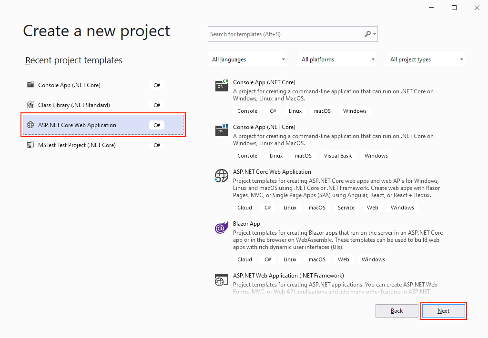
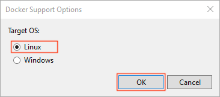
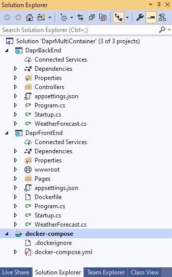
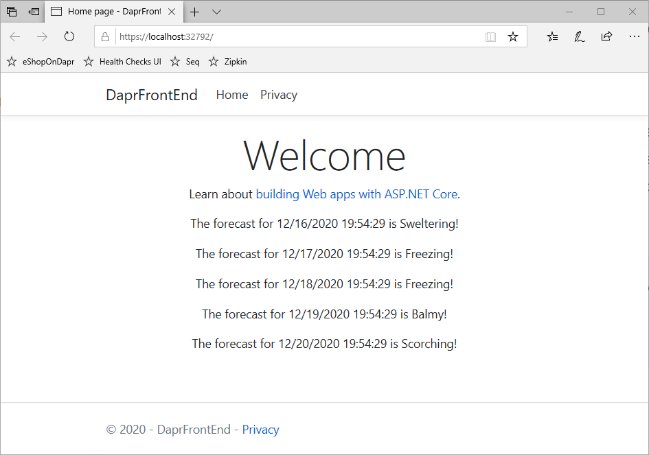

# Getting started with Dapr

In the first two chapters, you learned basic concepts about Dapr. It's time to take it for a *test drive*. This chapter will guide you through preparing your local development environment and building two Dapr .NET applications.

## Installing Dapr into your local environment

You'll start by installing Dapr on your development computer. Once complete, you can build and run Dapr applications in [self-hosted mode](https://docs.dapr.io/operations/hosting/self-hosted/self-hosted-overview/).

1. [Install the Dapr CLI](https://docs.dapr.io/getting-started/install-dapr-cli/). It enables you to launch, run, and manage Dapr instances. It also provides debugging support.

1. Install [Docker Desktop](https://docs.docker.com/get-docker/). If you're running on Windows, make sure that **Docker Desktop for Windows** is configured to use Linux containers.

  > [!NOTE]
  > By default, Dapr uses Docker containers to provide you the best out-of-the-box experience. To run Dapr outside of Docker, you can skip this step and [execute a *slim* initialization](https://docs.dapr.io/operations/hosting/self-hosted/self-hosted-no-docker/). The examples in this chapter require you use Docker containers.

1. [Initialize Dapr](https://docs.dapr.io/getting-started/install-dapr/). This step sets up your development environment by installing the latest Dapr binaries and container images.

1. Install the [.NET Core 3 Development Tools](https://dotnet.microsoft.com/download/dotnet-core/3.1) for .NET Core 3.1.

Now that Dapr is installed, it's time to build your first Dapr application!

## Building your first Dapr application

You'll start by building a simple .NET Console application that consumes the [Dapr state management](state-management.md) building block.

### Create the application

1. Open up the command shell or terminal of your choice. You might consider the terminal capabilities in [Visual Studio Code](https://code.visualstudio.com/). Navigate to the root folder in which you want to build your application. Once there, enter the following command to create a new .NET Console application:

   ```console
   dotnet new console -o DaprCounter
   ```

   The command scaffolds a simple "Hello World" .NET Core application.  

1. Then, navigate into the new directory created by the previous command:

   ```console
   cd DaprCounter
   ```

1. Run the newly created application using the `dotnet run` command. Doing so writes "Hello World!" to the console screen:

   ```console
   dotnet run
   ```

### Add Dapr State Management

Next, you'll use the Dapr [state management building block](https://docs.dapr.io/developing-applications/building-blocks/state-management/state-management-overview/) to implement a stateful counter in the program.

You can invoke Dapr APIs across any development platform using Dapr's native support for HTTP and gRPC. However, .NET Developers will find the Dapr .NET SDK more natural and intuitive. It provides a strongly-typed .NET client to call the Dapr APIs. The .NET SDK also tightly integrates with ASP.NET Core.

1. From the terminal window, add the `Dapr.Client` NuGet package to your application:

   ```console
   dotnet add package Dapr.Client
   ```

   > [!NOTE]
   > If you're working with a pre-release version of Dapr, be sure to add the `--prerelease` flag to the command.

1. Open the `Program.cs` file in your favorite editor and update its contents to the following code:

   ```csharp
   using System;
   using System.Threading.Tasks;
   using Dapr;
   using Dapr.Client;
   
   namespace DaprCounter
   {
       class Program
       {
           static async Task Main(string[] args)
           {
               var daprClient = new DaprClientBuilder().Build();
   
               var counter = await daprClient.GetStateAsync<int>("statestore", "counter");
   
               while (true)
               {
                   Console.WriteLine($"Counter = {counter++}");
   
                   await daprClient.SaveStateAsync("statestore", "counter", counter);
   
                   await Task.Delay(1000);
               }
           }
       }
   }
   ```

   The updated code implements the following steps:

   - First a new `DaprClient` instance is instantiated. This class enables you to interact with the Dapr sidecar.
   - From the state store, `DaprClient.GetStateAsync` fetches the value for the `counter` key. If the key doesn't exist, the default `int` value (which is `0`) is returned.
   - The code then iterates, writing the `counter` value to the console and saving an incremented value to the state store.

1. The Dapr CLI `run` command starts the application. It invokes the underlying Dapr runtime and enables both the application and Dapr sidecar to run together. If you omit the `app-id`, Dapr will generate a unique name for the application. The final segment of the command, `dotnet run`, instructs the Dapr runtime to run the .NET core application.

   > [!IMPORTANT]
   > Care must be taken to always pass an explicit `app-id` parameter when consuming the state management building block. The block uses the application id value as a *prefix* for its state key for each key/value pair. If the application id changes, you can no longer access the previous stored state.

   Now run the application with the following command:

   ```console
   dapr run --app-id DaprCounter dotnet run
   ```

   Try stopping and restarting the application. You'll see that the counter doesn't reset. Instead it continues from the previously saved state. The Dapr building block makes the application stateful.

> [!IMPORTANT]
> It's important to understand your sample application communicates with a pre-configured state component, but has no direct dependency on it. Dapr abstracts away the dependency. As you'll shortly see, the underlying state store component can be changed with a simple configuration update.

You might be wondering, where exactly is the state stored?

## Component configuration files

When you first initialized Dapr for your local environment, it automatically provisioned a Redis container. Dapr then configured the Redis container as the default state store component with a component configuration file, entitled `statestore.yaml`. Here's a look at its contents:

```yaml
apiVersion: dapr.io/v1alpha1
kind: Component
metadata:
  name: statestore
spec:
  type: state.redis
  version: v1
  metadata:
  - name: redisHost
    value: localhost:6379
  - name: redisPassword
    value: ""
  - name: actorStateStore
    value: "true"
```

> [!NOTE]
> Default component configuration files are stored in the `$HOME/.dapr/components` folder on Linux/macOS, and in the `%USERPROFILE%\.dapr\components` folder on Windows.

Note the format of the previous component configuration file:

- Each component has a name. In the sample above, the component is named `statestore`. We used that name in our first code example to tell the Dapr sidecar which component to use.
- Each component configuration file has a `spec` section. It contains a `type` field that specifies the component type. The `version` field specifies the component version. The `metadata` field contains information that the component requires, such as connection details and other settings. The metadata values will vary for the different types of components.

A Dapr sidecar can consume any Dapr component configured in your application. But, what if you had an architectural justification to limit the accessibility of a component? How could you restrict the Redis component to Dapr sidecars running only in a production environment?

To do so, you could define a `namespace` for the production environment. You might name it `production`. In self-hosted mode, you specify the namespace of a Dapr sidecar by setting the `NAMESPACE` environment variable. When configured, the Dapr sidecar will only load the components that match the namespace. For Kubernetes deployments, the Kubernetes namespace determines the components that are loaded. The following sample shows the Redis component placed in a `production` namespace. Note the `namespace` declaration in the `metadata` element:

```yaml
apiVersion: dapr.io/v1alpha1
kind: Component
metadata:
  name: statestore
  namespace: production
spec:
  type: state.redis
  version: v1
  metadata:
  - name: redisHost
    value: localhost:6379
  - name: redisPassword
    value: ""
  - name: actorStateStore
    value: "true"
```

> [!IMPORTANT]
> A namespaced component is only accessible to applications running in the same namespace. If your Dapr application fails to load a component, make sure that the application namespace matches the component namespace. This can be especially tricky in self-hosted mode where the application namespace is stored in a `NAMESPACE` environment variable.

If needed, you could further restrict a component to a particular application. Within the `production` namespace, you may want to limit access of the Redis cache to only the `DaprCounter` application. You do so by specifying `scopes` in the component configuration. The following example shows how to restrict access to the Redis `statestore` component to the application `DaprCounter` in the `production` namespace:

```yaml
apiVersion: dapr.io/v1alpha1
kind: Component
metadata:
  name: statestore
  namespace: production
spec:
  type: state.redis
  version: v1
  metadata:
  - name: redisHost
    value: localhost:6379
  - name: redisPassword
    value: ""
  - name: actorStateStore
    value: "true"
  scopes:
  - DaprCounter
```

## Building a multi-container Dapr application

In the first example, you created a simple .NET console application that ran side-by-side with a Dapr sidecar. Modern distributed applications, however, often consist of many moving parts. They can simultaneously run independent microservices. These modern applications are typically containerized and require container orchestration tools such as Docker Compose or Kubernetes.

In the next example, you'll create a multi-container application. You'll also use the [Dapr service invocation](service-invocation.md) building block to communicate between services. The solution will consist of a  web application that retrieves weather forecasts from a  web API. The  and  will each run in a Docker container. You'll use Docker Compose to run the container locally and enable debugging capabilities.

Make sure you've configured your local environment for Dapr and installed the [.NET Core 3 Development Tools](https://dotnet.microsoft.com/download/dotnet-core/3.1) (instructions are available at the beginning of this chapter).

Additionally, you'll need complete this sample using [Visual Studio 2019](https://visualstudio.microsoft.com/downloads) with the **.NET Core cross-platform development** workload installed.

### Create the application

1. In Visual Studio 2019, create an **ASP.NET Core Web Application** project:

   

1. Name your project `DaprFrontEnd` and your solution `DaprMultiContainer`:

   

1. Select **Web Application** to create a web application with Razor pages. Don't select **Enable Docker Support**. You'll add Docker support later.

   

1. Add a second ASP.NET Core Web Application project to the same solution and call it *DaprBackEnd*. Select **API** as the project type. By default, a Dapr sidecar relies on the network boundary to limit access to its public API. Therefore, clear the checkbox for **Configure for HTTPS**.

   

### Add Dapr service invocation

Now, you'll configure communication between the services using Dapr [service invocation building block](https://docs.dapr.io/developing-applications/building-blocks/service-invocation/service-invocation-overview/). You'll enable the  web app to retrieve weather forecasts from the  web API. The service invocation building block features many benefits. It includes service discovery, automatic retries, message encryption (using mTLS), and improved observability. You'll use the Dapr .NET SDK to invoke the service invocation API on the Dapr sidecar.

1. In Visual Studio, open the Package Manager Console (**Tools > NuGet Package Manager > Package Manager Console**) and make sure that `DaprFrontEnd` is the default project. From the console, add the `Dapr.AspNetCore` NuGet package to the project:

   ```console
   Install-Package Dapr.AspNetCore
   ```

   > [!NOTE]
   > If you're targeting a version of `Dapr.AspNetCore` that is in prerelease, you need to specify the `-Prerelease` flag.

1. In the `DaprFrontEnd` project, open the *Startup.cs* file, and replace the `ConfigureServices` method with the following code:

   ```csharp
   // This method gets called by the runtime. Use this method to add services to the container.
   public void ConfigureServices(IServiceCollection services)
   {
       services.AddControllers().AddDapr();
       services.AddRazorPages();
   }
   ```

   The call to `AddDapr` registers the `DaprClient` class with the ASP.NET Core dependency injection system. You'll use the `DaprClient` class later on to communicate with the Dapr sidecar.

1. Add a new C# class file named *WeatherForecast* to the `DaprFrontEnd` project:

   ```csharp
   using System;
      
   namespace DaprFrontEnd
   {
       public class WeatherForecast
       {
           public DateTime Date { get; set; }
      
           public int TemperatureC { get; set; }
      
           public int TemperatureF { get; set; }
      
           public string Summary { get; set; }
       }
   }
   ```

1. Open the *Index.cshtml.cs* file in the *Pages* folder, and replace its contents with the following code:

   ```csharp
   using System;
   using System.Collections.Generic;
   using System.Net.Http;
   using System.Threading.Tasks;
   using Dapr.Client;
   using Microsoft.AspNetCore.Mvc.RazorPages;

   namespace DaprFrontEnd.Pages
   {
       public class IndexModel : PageModel
       {
           private readonly DaprClient _daprClient;

           public IndexModel(DaprClient daprClient)
           {
               _daprClient = daprClient ?? throw new ArgumentNullException(nameof(daprClient));
           }

           public async Task OnGet()
           {
               var forecasts = await _daprClient.InvokeMethodAsync<IEnumerable<WeatherForecast>>(
                   HttpMethod.Get,
                   "daprbackend",
                   "weatherforecast");

               ViewData["WeatherForecastData"] = forecasts;
           }
       }
   }
   ```

   You add Dapr capabilities into the  web app by injecting the `DaprClient` class into `IndexModel` constructor. In the `OnGet` method, you call the  API service with the Dapr service invocation building block. The `OnGet` method is invoked whenever a user visits the home page. You use the `DaprClient.InvokeMethodAsync` method to invoke the `weatherforecast` method of the `daprbackend` service. You'll configure the  web API to use `daprbackend` as its application id later on when configuring it to run with Dapr. Finally, the service response is saved in view data.

1. Replace the contents of the *Index.cshtml* file in the *Pages* folder, with the following code. It displays the weather forecasts stored in the view data to the user:

   ```html
   @page
   @model IndexModel
   @{
       ViewData["Title"] = "Home page";
   }
   
   <div class="text-center">
       <h1 class="display-4">Welcome</h1>
       <p>Learn about <a href="https://docs.microsoft.com/aspnet/core">building Web apps with ASP.NET Core</a>.</p>
       @foreach (var forecast in (IEnumerable<WeatherForecast>)ViewData["WeatherForecastData"])
       {
           <p>The forecast for @forecast.Date is @forecast.Summary!</p>
       }
   </div>
   ```

### Add container support

In the final part of this example, you'll add container support and run the solution using Docker Compose.

1. Right-click the `DaprFrontEnd` project, and choose **Add > Container Orchestrator Support**. The **Add Container Orchestrator Support** dialog appears:

   

   Choose **Docker Compose**.

1. In the next dialog, select **Linux** as the Target OS:

   

   Visual Studio creates a *docker-compose.yml* file and a *.dockerignore* file in the **docker-compose** folder in the solution:

   

   The *docker-compose.yml* file has the following content:

   ```yaml
   version: '3.4'
   
   services:
     daprfrontend:
       image: ${DOCKER_REGISTRY-}daprfrontend
       build:
         context: .
         dockerfile: DaprFrontEnd/Dockerfile
   
   ```

   The *.dockerignore* file contains file types and extensions that you don't want Docker to include in the container. These files are associated with the development environment and source control and not the app or service you're deploying.

1. In the `DaprBackEnd` web API project, right-click on the project node, and choose **Add** > **Container Orchestrator Support**. Choose **Docker Compose**, and then select **Linux** again as the target OS.

   Open the *docker-compose.yml* file again and examine its contents. Visual Studio has update the Docker Compose file. Now both services are included:

   ```yaml
   version: '3.4'
   
   services:
     daprfrontend:
       image: ${DOCKER_REGISTRY-}daprfrontend
       build:
         context: .
         dockerfile: DaprFrontEnd/Dockerfile
   
     daprbackend:
       image: ${DOCKER_REGISTRY-}daprbackend
       build:
         context: .
         dockerfile: DaprBackEnd/Dockerfile
   ```

1. To use Dapr building blocks from inside a containerized application, you'll need to add the Dapr sidecars containers to your Compose file. Carefully update the content of the *docker-compose.yml* file to match the following example. Pay close attention to the formatting and spacing and don't use tabs.

   ```yaml
   version: '3.4'
   
   services:
     daprfrontend:
       image: ${DOCKER_REGISTRY-}daprfrontend
       build:
         context: .
         dockerfile: DaprFrontEnd/Dockerfile
       ports:
         - "51000:50001" 
   
     daprfrontend-dapr:
       image: "daprio/daprd:latest"
       command: [ "./daprd", "-app-id", "daprfrontend", "-app-port", "80" ]
       depends_on:
         - daprfrontend
       network_mode: "service:daprfrontend"
   
     daprbackend:
       image: ${DOCKER_REGISTRY-}daprbackend
       build:
         context: .
         dockerfile: DaprBackEnd/Dockerfile
       ports:
         - "52000:50001"
   
     daprbackend-dapr:
       image: "daprio/daprd:latest"
       command: [ "./daprd", "-app-id", "daprbackend", "-app-port", "80" ]
       depends_on:
         - daprfrontend
       network_mode: "service:daprbackend" 
   ```

   In the updated file, we've added `daprfrontend-dapr` and `daprbackend-dapr` sidecars for the `daprfrontend` and `daprbackend` services respectively. In the updated file, pay close attention to the following changes:

   - The sidecars use the `daprio/daprd:latest` container image. The use of the `latest` tag isn't recommended for production scenarios. For production, it's better to use a specific version number.
   - Each service defined in the Compose file has its own network namespace for network isolation purposes. The sidecars use `network_mode: "service:..."` to ensure they run in the same network namespace as the application. Doing so allows the sidecar and the application to communicate using `localhost`.
   - The ports on which the Dapr sidecars are listening for gRPC communication (by default 50001) must be exposed to allow the sidecars to communicate with each other.

1. Run the solution (**F5** or **Ctrl+F5**) to verify that it works as expected. If everything is configured correctly, you should see the weather forecast data:

   

   Running locally with Docker Compose and Visual Studio 2019, you can set breakpoints and debug into the application. For production scenarios, it's recommended to host your application in Kubernetes. This book includes an accompanying reference application, [eShopOnDapr](https://github.com/dotnet-architecture/eShopOnDapr), that contains scripts to deploy to Kubernetes.

   To learn more about the Dapr service invocation building block used in this walkthrough, refer to [chapter 6](service-invocation.md).

## Summary

In this chapter, you had an opportunity to *test drive* Dapr. Using the Dapr .NET SDK, you saw how Dapr integrates with the .NET application platform.

The first example was a simple, stateful, .NET Console application that used the Dapr state management building block.

The second example involved a multi-container application running in Docker. By using Visual Studio with Docker Compose, you experienced the familiar *F5 debugging experience* available across all .NET apps.

You also got a closer look at Dapr component configuration files. They configure the actual infrastructure implementation used by the Dapr building blocks. You can use namespaces and scopes to restrict component access to particular environments and applications.

In the upcoming chapters, you'll dive deep into the building blocks offered by Dapr.

### References

- [Dapr documentation - Getting started](https://docs.dapr.io/getting-started/)

- [eShopOnDapr](https://github.com/dotnet-architecture/eShopOnDapr)

> [!div class="step-by-step"]
> [Previous](dapr-at-20000-feet.md)
> [Next](reference-application.md)
