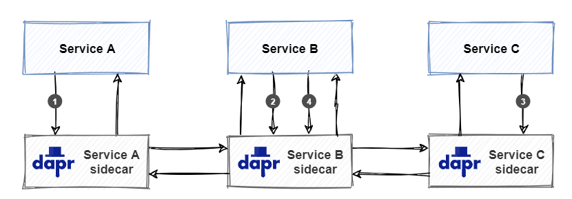
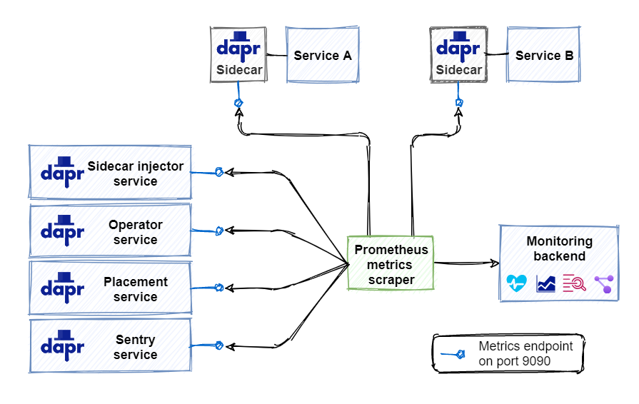
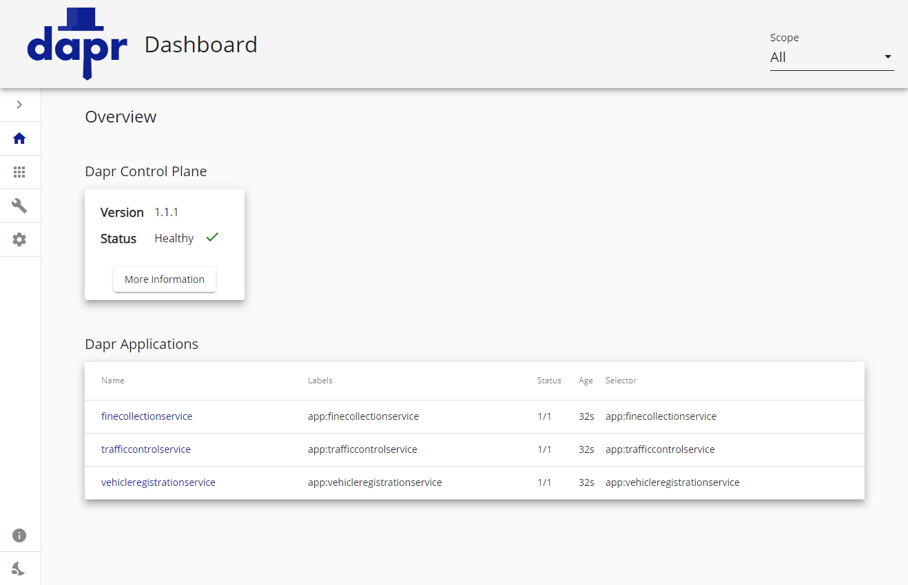

# Dapr observability

Distributed systems concurrently manage independent microservices and backing services (databases, message brokers, key vaults) that compose together to form an application. With so many moving parts, system monitoring takes on a new meaning. [Observability](https://docs.microsoft.com/dotnet/architecture/cloud-native/observability-patterns), as it's called, assures insight into the health of the application at all times. It's necessary for effectively monitoring and troubleshooting the application. 

The information used to gain observability is referred to as **telemetry** and can be divided into four broad categories: 

1. **Distributed tracing** provides insight into the traffic between the services and which services are involved in distributed transactions.
1. **Metrics** provides insight into the performance of a service and its resource consumption.
1. **Logging** provides insight into how the code is being executed at runtime and whether any errors have occurred.
1. **Health** endpoints provide insight into the readiness and availability of a service.

The depth of telemetry depends on the observability features supported by application platform. The Azure cloud provides a platform provides a rich telemetry experience including all of the telemetry categories. Azure features a service called [Application Insights](https://docs.microsoft.com/azure/azure-monitor/app/app-insights-overview). The service is automatically enabled for Azure IaaS and PaaS services. When an application is built with Azure services, telemetry is gathered automatically and sent to Application Insights. Included is application logging, exceptions, utilization metrics, and the duration of all requests. It can even render a diagram showing the dependencies between services based on their communication.

Let's look at how Dapr add observability to our distributed applications.

## What it solves

Dapr abstracts plumbing.

For an application consuming Azure resources, Azure Application Insights automatically captures feature-rich observability - out-of-the-box. But what if an application can't use Azure resources? Is it still possible to take advantage of the rich telemetry experience of Application Insights?

The answer is yes. A non-Azure application can import libraries, add configuration and instrumentation code to emit telemetry to Azure Application Insights. However, this approach **tightly couples** the application to Application Insights. Moving the app to a different monitoring platform would involve expensive refactoring. Wouldn't it be great to avoid tight coupling and consume observability outside of the code? Dapr can make that happen.

The Dapr Observability Building Block decouples observability plumbing from the application. It captures traffic generated by Dapr building blocks. The block also correlates requests and responses that are included in the single operation across multiple services. Finally, Dapr provides endpoints for querying health status and metrics for performance and resource utilization. Dapr exposes all telemetry in open-standard formats enabling information to be fed into the monitoring backend of choice. There, the information can be visualized, queried, and analyzed.

Because Dapr abstracts the plumbing, the application is unaware of how observability is implemented. There's no need for referencing libraries or implementing custom instrumentation code. Dapr allows the developer to focus on building business logic, not observability plumbing. Observability is configured at the Dapr level and is consistent across services, even when created by different teams, and written in different programming platforms.

Let's dive in and see how observability works in Dapr!

## How it works

Dapr's [sidecar architecture](dapr-at-20000-feet.md#sidecar-architecture) enables many observability features. As services communicate with Dapr sidecars, the sidecars intercept all communication between the services. Together with logging and metrics, the sidecars provide the necessary telemetry to monitor an application. The telemetry is provided in an open standards format. By default, Dapr supports [OpenTelemetry](https://opentelemetry.io/) and [Zipkin](https://zipkin.io/) enabling monitoring backend software to ingest the Dapr telemetry for analysis and querying. 

Dapr exposes configurable [collectors](https://docs.dapr.io/operations/monitoring/open-telemetry-collector/) that collect and publish telemetry to a monitoring backend. Dapr can integrate with several different monitoring backends, including Application Insights. Figure 9-1 shows an overview of the Dapr observability architecture:


**Figure 9-1**: Overview of the Dapr observability architecture

1. Service A calls an operation on Service B. This call is routed through the Dapr sidecars to Service B.
1. When complete, the response is sent back to Service A through the Dapr sidecars. The sidecars gather and publish all available telemetry for every request and response.
1. The configured collector ingests the telemetry and sends it to the monitoring backend.  

Configuring observability is different from the other Dapr building blocks, like pub/sub or state management. Instead of configuring observability, a collector and the monitoring backend of choice are configured. As shown above in Figure 9-1, it's possible to configure multiple collectors that integrate with different monitoring backends.

At the beginning of this chapter, four broad categories of telemetry were identified. The following sections will provide details. They'll include instructions on how to configure collectors that integrate with popular monitoring backends


*****************************************************************************************************************
******** Confused here: We don't discuss Kubernetes in the Getting Started chapter. Think we adjust accordingly
> [!IMPORTANT]
> Because observability is critical when running in production, the examples will focus on production scenarios and assume the example application is running in Kubernetes with Dapr is installed on the cluster (see [Chapter 2- Getting started](ch3-getting-started.md) for instructions).

********
*****************************************************************************************************************


### Distributed tracing

Distributed tracing provides insight into the traffic that flows across services in a distributed application. The log of exchanged requests and responses (or, messages) is an invaluable source of information for troubleshooting issues. The hard part is correlating traffic across multiple services for a distributed business transaction. To correlate messages, Dapr uses the [W3C Trace Context](https://www.w3.org/TR/trace-context) standard.

The W3C Trace Context is a specification that injects context information into requests and responses for correlation. Figure 9-2 shows how correlation works:



**Figure 9-2**: W3C Trace Context example

1. Service A invokes an operation on Service B. As Service A starts the call, Dapr creates a unique trace context and injects it into the request.
1. Service B receives the request and invokes an operation on Service C. Dapr detects that the incoming request contains a trace context and propagates it by injecting it into the outgoing request to Service C.  
1. Service C receives the request and handles it. Dapr detects that the incoming request contains a trace context and propagates it by injecting it into the outgoing response back to Service B.
1. Service B receives the response and handles it. It then creates a new response and propagates the trace context by injecting it into the outgoing response back to Service A.

Dapr emits telemetry that contains the trace context information. With this information, it's easy to correlate requests and responses that are part of a distributed transaction across multiple services.

In tracing terminology, a set of requests and responses that belong together is called a *trace*. A trace contains a *span* for every request/response pair. Figure 9-3 shows a trace:


**Figure 9-3**: Traces and spans

In the figure, note how the trace represents a unique application transaction and each span a single operation within the trace.

The next sections discuss how to inspect tracing telemetry by publishing it to a monitoring backend.

#### Using Zipkin as monitoring backend

[Zipkin][3] is an open-source distributed tracing system. It can ingest and visualize telemetry data. Dapr offers support for Zipkin by default. This example demonstrates how to configure Zipkin to visualize Dapr telemetry.

##### Enable and configure tracing

First, tracing must be enabled for the Dapr runtime using a Dapr configuration file. Here's an example of a configuration file named `tracing-config.yaml`:  

```yaml
apiVersion: dapr.io/v1alpha1
kind: Configuration
metadata:
  name: tracing-config
  namespace: default
spec:
  tracing:
    samplingRate: "1"
    zipkin:
      endpointAddress: "http://zipkin.default.svc.cluster.local:9411/api/v2/spans"
```

The `samplingRate` specifies the interval used for publishing traces. The value must be between `0` (tracing disabled) and `1` (every trace is published). With a value of `0.5`, every other trace is published, significantly reducing the amount of telemetry data being published. The `endpointAddress` points to an endpoint on a Zipkin server running in a Kubernetes cluster. The default port for Zipkin is `9411`.

> [!NOTE]
> When installing Dapr in standalone mode, a Zipkin server is automatically installed and tracing is enabled in the default configuration file located in `$HOME/.dapr/config.yaml` or `%USERPROFILE%\.dapr\config.yaml` on Windows).

The configuration must be applied to the Kubernetes cluster using the Kubernetes CLI:

```bash
kubectl apply -f tracing-config.yaml
```

##### Install the Zipkin server

By default, no Zipkin server is installed when installing Dapr into a Kubernetes cluster. The following Kubernetes manifest file named `zipkin.yaml`, deploys a standard Zipkin server to the cluster:

```yaml
kind: Deployment
apiVersion: apps/v1
metadata:
  name: zipkin
  namespace: eshop
  labels:
    service: zipkin
spec:
  replicas: 1
  selector:
    matchLabels:
      service: zipkin
  template:
    metadata:
      labels:
        service: zipkin
    spec:
      containers:
        - name: zipkin
          image: openzipkin/zipkin-slim
          imagePullPolicy: IfNotPresent
          ports:
            - name: http
              containerPort: 9411
              protocol: TCP

---

kind: Service
apiVersion: v1
metadata:
  name: zipkin
  namespace: eshop
  labels:
    service: zipkin
spec:
  type: NodePort
  ports:
    - port: 9411
      targetPort: 9411
      nodePort: 32411
      protocol: TCP
      name: zipkin
  selector:
    service: zipkin

```

The deployment uses the standard `openzipkin/zipkin-slim` container image. The Zipkin service exposes the Zipkin website, which you can use to view the telemetry on port `32411`. Use the Kubernetes CLI to apply the Zipkin manifest file to the Kubernetes cluster and deploy the Zipkin server:

```bash
kubectl apply -f zipkin.yaml
```

##### Configure the services to use the tracing configuration

Now everything is set up correctly to start publishing telemetry. Every Dapr sidecar that is deployed as part of the application must be instructed to start emitting telemetry when started. To do that, add a `dapr.io/config` annotation that references the `tracing-config` configuration to each service's deployment. Here's an example of the eShop Ordering API service's manifest file containing the annotation:

```yaml
apiVersion: apps/v1
kind: Deployment
metadata:
  name: ordering-api
  namespace: eshop
  labels:
    app: eshop
spec:
  replicas: 1
  selector:
    matchLabels:
      app: eshop
  template:
    metadata:
      labels:
        app: simulation
      annotations:
        dapr.io/enabled: "true"
        dapr.io/app-id: "simulation"
        dapr.io/config: "tracing-config"
    spec:
      containers:
      - name: simulation
        image: eshop/ordering.api:linux-latest
```

##### Inspect the telemetry in Zipkin

Once the application is started, the Dapr sidecars will start emitting telemetry to the Zipkin server. To inspect this telemetry, point a web-browser to [http://localhost:32411](http://localhost:32411). You'll see the Zipkin webpage, as shown in Figure 9-2:


 **Figure 9-1**: The Zipkin start page

On the *Find a trace* tab, you can query traces. Pressing the *RUN QUERY* button without specifying any restrictions will show all the ingested *traces*, as shown in Figure 9-3:


**Figure 9-3**: A list of traces

Clicking the *SHOW* button next to a specific trace, will show the details of that trace, as shown in Figure 9-4:


**Figure 9-4**: The details of a trace

Each item on the details page, represents a span that is an operation in the selected trace.

##### Inspect the dependencies between services

Because Dapr sidecars handle all traffic between the services, Zipkin can use the trace information to determine the dependencies between the services. To see it in action, go to the *Dependencies* tab on the Zipkin web page and click the button with the magnifying glass. Zipkin will show an overview of the services and their dependencies, as seen in Figure 9-5:


**Figure 9-5**: A dependency graph in Zipkin

The animated dots on the lines between the services represent requests and move from source to destination. Red dots indicate a failed request.

#### Using Jaeger or New Relic as monitoring backend

[5]:  "Jaeger"
[6]:  "New Relic"


Besides Zipkin, other monitoring backends can also ingest telemetry in the Zipkin format. Examples include [Jaeger](https://www.jaegertracing.io/) and [New Relic](https://newrelic.com/). To try them out, specify an `endpointAddress` pointing to either a Jaeger or New Relic server in the Dapr configuration file. Here's an example of a configuration file that configures Dapr to send telemetry to a Jaeger server. The URL for Jaeger API is identical to the URL for the Zipkin API. The only difference is the port on which the server is running:

 ```yaml
 apiVersion: dapr.io/v1alpha1
 kind: Configuration
 metadata:
   name: tracing-config
   namespace: default
 spec:
   tracing:
     samplingRate: "1"
     zipkin:
       endpointAddress: "http://localhost:9415/api/v2/spans"
 ```

For New Relic, specify the endpoint of the New Relic API. Here's an example of a configuration file for New Relic:

 ```yaml
apiVersion: dapr.io/v1alpha1
 kind: Configuration
 metadata:
   name: tracing-config
   namespace: default
 spec:
   tracing:
     samplingRate: "1"
     zipkin:
       endpointAddress: "https://trace-api.newrelic.com/trace/v1?Api-Key=<NR-API-KEY>&Data-Format=zipkin&Data-Format-Version=2"
 ```

Check out the Jaeger and New Relic websites for more information on how to use them.

### Metrics

Metrics provide insight into performance and resource consumption. By default, Dapr emits system metrics for the Dapr system services like Operator, Sidecar-Injector, etcetera. These metrics are also referred to as the Dapr "system" metrics. Dapr also emits metrics for Dapr sidecars. These are also referred to as Dapr "runtime" metrics. Dapr uses the [Prometheus][7] metrics standard and each Dapr sidecar exposes a metrics endpoint on port `9090`. A *Prometheus scraper* calls this endpoint at a certain interval to collect all the metrics. The scraper sends them to a monitoring backend. You deploy a metrics scraper together with your application. Figure 9-6 shows an example of how this works:



**Figure 9-6**: Scraping Prometheus metrics

#### Service discovery

You might wonder how the metrics scraper knows which services to connect to for collecting metrics. Well, Prometheus can leverage different discovery mechanisms to discover services in the environment it's deployed in. When running in Kubernetes, it can leverage the Kubernetes API to find all available Kubernetes resources running in the environment.

#### Metrics list

Dapr provides a large set of metrics for the Dapr system services and Dapr runtime. Some examples are:

| Metric                                         | Source | Description                                                  |
| ---------------------------------------------- | :----: | ------------------------------------------------------------ |
| dapr_operator_service_created_total            | System | The total number of Dapr services created by the Dapr Operator service. |
| dapr_injector_sidecar_injection/requests_total | System | The total number of sidecar injection requests received by the Dapr Sidecar-Injector service. |
| dapr_placement_runtimes_total                  | System | The total number of hosts reported to the Dapr Placement service. |
| dapr_sentry_cert_sign_request_received_total   | System | The number of certificate signing requests (CRSs) received by the Dapr Sentry service. |
| dapr_runtime_component_loaded      | Runtime | The number of successfully loaded Dapr components.           |
| dapr_grpc_io_server_completed_rpcs | Runtime | Count of gRPC calls by method and status.                    |
| dapr_http_server_request_count     | Runtime | Number of HTTP requests started in an HTTP server.           |
| dapr_http/client/sent_bytes        | Runtime | Total bytes sent in request body (not including headers) by an HTTP client. |

See the [Dapr metrics documentation](https://docs.dapr.io/developing-applications/building-blocks/observability/metrics/) for a complete list of available metrics.

#### Configuring Dapr metrics

You can disable the metrics collection endpoint for system services by specifying `--enable-metrics=false` on the command-line that starts the system processes. If metrics are enabled, you can also change the default port for the endpoint by specifying this on the command-line: `--metrics-port 9090`.

You can use a Dapr configuration file to enable or disable runtime metrics collection:

```yaml
apiVersion: dapr.io/v1alpha1
kind: Configuration
metadata:
  name: dapr-config
  namespace: eshop
spec:
  tracing:
    samplingRate: "1"
  metric:
    enabled: false
```

#### Visualizing Dapr metrics

As stated, you need a Prometheus scraper deployed with your application to collect the metrics. But looking at a bunch of raw metrics is not something that people are very good at. A good way to analyze metrics is using a visualization tool like [Grafana][8]. Grafana offers the ability to create dashboards from the available metrics. In Figure 9-7 you can see an example of a dashboard showing several system metrics:


**Figure 9-7**: Grafana dashboard showing Dapr system metrics

Instructions on how to set this up The Dapr documentation features a [tutorial for installing Prometheus and Grafana](https://docs.dapr.io/operations/monitoring/grafana/).

### Logging

Logging provides insight into what is happening with a service at runtime. When running the application with Dapr, it emits all the logging from the Dapr sidecars and system services automatically. Logging from your application code is not automatically included. You can however use a specific SDK like the [OpenTelemetry SDK for .NET][9] to emit logging from your application code.  

#### Log entry structure

Dapr emits structured logging. Each log entry has the following structure:

| Field    | Description                                          | Example                             |
| -------- | ---------------------------------------------------- | ----------------------------------- |
| time     | ISO8601 formatted timestamp                          | `2021-01-10T14:19:31.000Z`          |
| level    | Level of the entry (debug \| info \| warn  \| error) | `info`                              |
| type     | Log Type                                             | `log`                               |
| msg      | Log Message                                          | `metrics server started on :62408/` |
| scope    | Logging Scope                                        | `dapr.runtime`                      |
| instance | Hostname where Dapr runs                             | TSTSRV01                            |
| app_id   | Dapr App ID                                          | ordering-api                        |
| ver      | Dapr Runtime Version                                 | `1.0.0`-rc.2                        |

When searching through logging in a troubleshooting scenario, the `time` and `level` fields are particularly useful. The time field allows ordering the logging and selecting the logging emitted during a specific timeslot. When troubleshooting some bug, debug level logging gives you more information on the behavior of the code.

#### Plain text vs. JSON format

By default, Dapr emits structured logging in plain-text format. Here's an example of some logging:

```text
== DAPR == time="2021-01-12T16:11:39.4669323+01:00" level=info msg="starting Dapr Runtime -- version 1.0.0-rc.2 -- commit 196483d" app_id=ordering-api instance=TSTSRV03 scope=dapr.runtime type=log ver=1.0.0-rc.2
== DAPR == time="2021-01-12T16:11:39.467933+01:00" level=info msg="log level set to: info" app_id=ordering-api instance=TSTSRV03 scope=dapr.runtime type=log ver=1.0.0-rc.2
== DAPR == time="2021-01-12T16:11:39.467933+01:00" level=info msg="metrics server started on :62408/" app_id=ordering-api instance=TSTSRV03 scope=dapr.metrics type=log ver=1.0.0-rc.2
```

Every log entry is formatted as a string containing key/value pairs. This format is relatively hard to parse. If you are planning to put the logging into a monitoring tool so you can search through it, it is recommended to use JSON formatted logging. Each log entry is then formatted as a JSON object which is easier to parse. A monitoring tool can now index all the individual fields so they can be used in queries. Here is an example of the same logging in JSON format:

```json
{"app_id": "ordering-api", "instance": "TSTSRV03", "level": "info", "msg": "starting Dapr Runtime -- version 1.0.0-rc.2 -- commit 196483d", "scope": "dapr.runtime", "time": "2021-01-12T16:11:39.4669323+01:00", "type": "log", "ver": "1.0.0-rc.2"}
{"app_id": "ordering-api", "instance": "TSTSRV03", "level": "info", "msg": "log level set to: info", "scope": "dapr.runtime", "type": "log", "time": "2021-01-12T16:11:39.467933+01:00", "ver": "1.0.0-rc.2"}
{"app_id": "ordering-api", "instance": "TSTSRV03", "level": "info", "msg": "metrics server started on :62408/", "scope": "dapr.metrics", "type": "log", "time": "2021-01-12T16:11:39.467933+01:00", "ver": "1.0.0-rc.2"}
```

To enable JSON formatting, you need to configure that for each Dapr sidecar. In standalone mode, you enable structured logging by specifying the flag `--log-as-json` on the command-line:

```bash
dapr run --app-id ordering-api --log-level info --log-as-json dotnet run
```

In Kubernetes, you enable JSON formatted logging for the Dapr sidecars by adding a `dapr.io/log-as-json` annotation to every deployment in your application:

```yaml
kind: Deployment
apiVersion: apps/v1
metadata:
  name: ordering
  namespace: eshop
  labels:
    app: eshop
    service: ordering
spec:
  replicas: 1
  selector:
    matchLabels:
      service: ordering
  template:
    metadata:
      labels:
        app: eshop
        service: ordering
      annotations:
        dapr.io/enabled: "true"
        dapr.io/app-id: "ordering-api"
        dapr.io/app-port: "80"
        dapr.io/config: "dapr-config"
        dapr.io/log-as-json: "true"   # use JSON formatted logging
    spec:
      containers:
        - name: ordering-api
          image: eshop/ordering.api:linux-latest
          imagePullPolicy: IfNotPresent
          ports:
            - name: http
              containerPort: 80
              protocol: TCP
          envFrom:
            - configMapRef:
                name: ordering-cm
```

When you install Dapr in a Kubernetes cluster using Helm, you can enable JSON formatted logging for all the Dapr system services:

```bash
helm repo add dapr https://dapr.github.io/helm-charts/
helm repo update
kubectl create namespace dapr-system
helm install dapr dapr/dapr --namespace dapr-system --set global.logAsJson=true
```

#### Collecting logs

The logs emitted by Dapr can be fed into a monitoring backend for analysis. A log collector is a component that collects logs from a system and  sends it to a monitoring backend. A popular log collector is [Fluentd][10]. Check out the [How-To: Set up Fluentd, Elastic search and Kibana in Kubernetes](https://v1-rc2.docs.dapr.io/operations/monitoring/fluentd/) in the Dapr documentation. This article contains instructions for setting up Fluentd as log collector and the [ELK Stack][11] (Elastic Search and Kibana) as monitoring backend.

### Health status

The health status of a service provides insight into its availability. Each Dapr sidecar exposes a health API that can be used by the hosting environment to determine the health of the sidecar. The API has 1 operation:

```bash
GET http://localhost:3500/v1.0/healthz
```

The operation returns an HTTP status code:

- 204: the sidecar is healthy
- 500: the sidecar is not healthy

When running in stand-alone mode, there is nothing that invokes the health API automatically. You can invoke the API though from your application code or a health monitoring tool.

When running in Kubernetes, the Dapr sidecar-injector automatically configures Kubernetes to use the health API for executing *liveness probes* and *readiness probes*.

Kubernetes uses liveness probes to determine whether a container is up and running. If a liveness probe returns a failure code, Kubernetes will assume the container is dead and automatically restart it. This is one of the features of Kubernetes that increases the overall availability of your application.

Kubernetes uses readiness probes to determine whether a container is ready to start accepting traffic. A pod is considered ready when all the containers it contains are ready. One of the ways readiness probes are used in Kubernetes, is to determine whether a Kubernetes service can direct traffic to a pod in a load balancing scenario. Pods that are not ready are automatically removed from the load-balancer.

The liveness and readiness probes have several configurable parameters. They are configured in the container spec section of a pod's configuration file. By default, Dapr uses this configuration for each sidecar container:

```yaml
livenessProbe:
      httpGet:
        path: v1.0/healthz
        port: 3500
      initialDelaySeconds: 5
      periodSeconds: 10
      timeoutSeconds : 5
      failureThreshold : 3
readinessProbe:
      httpGet:
        path: v1.0/healthz
        port: 3500
      initialDelaySeconds: 5
      periodSeconds: 10
      timeoutSeconds : 5
      failureThreshold: 3
```

 The parameters are:

- The `path` to the health API.
- The `port` the Dapr sidecar runs on for HTTP request.
- The `initialDelaySeconds`: the number of seconds Kubernetes will wait before it starts probing a container for the first time.
- The `periodSeconds`: the number of seconds Kubernetes will wait between each probe.
- The `timeoutSeconds`: the number of seconds Kubernetes will wait on a response from the API before timing out. A timeout is interpreted as a failure.
- The `failureThreshold`: the amount of failures Kubernetes will accept before considering the container as not alive or not ready.

### Dapr dashboard

Dapr also offers a dashboard that gives information about Dapr applications, components, and configurations. The Dapr CLI offers a command for starting the dashboard and exposing it as a web-application on the local machine on port 8080:

```bash
dapr dashboard
```

When your Dapr application is running in Kubernetes, use:

```bash
dapr dashboard -k
```

The dashboard opens with an overview of all services in your application that have a Dapr sidecar. Figure 9-7 shows an example of the dashboard for the eShopOnDapr application running in Kubernetes:



**Figure 9-7**: Dapr dashboard overview page

The Dapr dashboard is invaluable when troubleshooting a Dapr application. It shows information about the Dapr sidecars and all the Dapr system services that make up the Dapr control Plane. You can drill down into the applied configuration of all these services and even look at the logging of every individual container.

The dashboard also shows the configured components (and their configuration) for your application. Figure 9-8 shows an example:


**Figure 9-8**: Dapr dashboard components page

There is a lot more information available in the dashboard. The best way to discover this is by running a Dapr application and browsing the dashboard. You can use the eShopOnDapr application for that.

Check out the [Dapr dashboard CLI command reference](https://docs.dapr.io/reference/cli/dapr-dashboard/) in the Dapr docs for a description of the dashboard command and its command-line arguments.

## Using the Dapr .NET SDK

The .NET SDK does not contain any specific observability features. All observability features are offered at the Dapr level.

If you want to emit telemetry from your .NET application, you need to use the SDK for the monitoring tool of your choice. The [OpenTelemetry SDK for .NET][9] for instance allows you to publish your application's telemetry using the Open Telemetry standard. Follow the specific SDK's documentation on how to configure and use it.

## Reference architecture: eShopOnDapr

Observability in eShopOnDapr consists of several parts. Obviously, the Dapr telemetry from all the sidecars is produced. But there are also some other observability features that were inherited from the eShopOnContainers sample that served as the base for eShopOnDapr.

### Custom health dashboard

The **WebStatus** project in eShopOnDapr is a custom health dashboard that gives insight into the health of the eShop services. This dashboard does not use the Dapr health API but uses the built-in [health checks mechanism](https://docs.microsoft.com/en-us/aspnet/core/host-and-deploy/health-checks?view=aspnetcore-3.1) of ASP.NET Core. A nice feature of this dashboard, is that it not only provides the health status of the services, but also the health of the dependencies of the services. A service that uses a database for instance, will also provide the health status of this database using the built-in database probe as shown in Figure 9-9:


**Figure 9-9**: eShopOnDapr custom health dashboard

### Seq log aggregator

[Seq][12] is a popular log aggregator server that is used in eShopOnDapr for log aggregation. Seq only ingests logging from the application services and not from the Dapr system services or sidecars. Seq ingests and indexes the structured application logging and offers a web front-end for analyzing and querying the logs. It also offers functionality for building monitoring dashboards.

The application services emit structured logging using the [SeriLog][13] logging library. Serilog publishes logging using so called "sinks". Many sinks are available, including one for Seq. This sink is used in eShopOnDapr.

### Application Insights

All the eShopOnDapr services send telemetry directly to Azure Application Insights using the Microsoft Application Insights SDK for .NET Core. See [Azure Application Insights for ASP.NET Core applications](https://docs.microsoft.com/en-us/azure/azure-monitor/app/asp-net-core) in the Microsoft docs for more information on how to use Application Insights with ASP.NET Core.

## Summary

Good observability is crucial when running a distributed system in production.

Dapr offers observability by producing different types of telemetry: distributed tracing, logging, metrics and health status.

Dapr only produces telemetry for the Dapr system services and sidecars. Telemetry from your application code is not automatically included. You can however use a specific SDK like the [OpenTelemetry SDK for .NET][9] to emit telemetry from your application code.

Dapr telemetry is produced in an open-standards based format so it can be ingested by a large set of available monitoring tools. Some examples are: [Zipkin][3], [Azure Application Insights][1], [ELK Stack][11], [New Relic][6], or [Grafana][8].

You need to deploy a telemetry collector or scraper with your Dapr application, that picks up the telemetry and forwards it to the monitoring backend.

Dapr can be configured to emit structured logging. Structured logging is easier to be indexed by a monitoring backend. This allows users to execute rich queries when searching through the logging.

Dapr offers a dashboard out of the box that presents information about the Dapr services and configuration.

## References

[1]: https://docs.microsoft.com/en-us/azure/azure-monitor/app/app-insights-overview/ "Azure Application Insights"
[2]: https://opentelemetry.io/ "Open Telemetry"
[3]: https://zipkin.io/ "Zipkin"
[4]: https://www.w3.org/TR/trace-context/ "W3C Trace Context"
[5]: https://www.jaegertracing.io/ "Jaeger"
[6]: https://newrelic.com/ "New Relic"
[7]: https://prometheus.io/ "Prometheus"
[8]: https://grafana.com/grafana/ "Grafana"
[9]: https://opentelemetry.io/docs/net/ "Open Telemetry SDK for .NET"
[10]: <https://www.fluentd.org/> "Fluentd"
[11]: https://www.elastic.co/elastic-stack "ELK stack"
[12]: https://datalust.co/seq "Seq"
[13]: https://serilog.net/ "Serilog"
