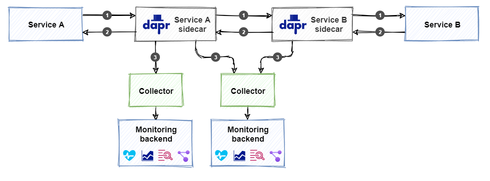
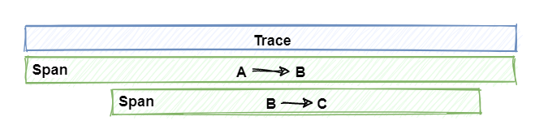
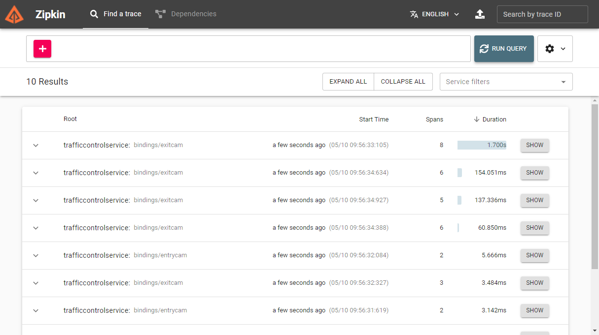

title: Dapr Observability
description: A description of the observability features of Dapr and how to apply them
author: edwinvw
ms.date: 01/24/2020

# Dapr observability

When building a distributed system (say, a microservices-based solution), it is crucial to have a good idea of what's going on with the services while running in production. We often refer to this as **observability**. Having observability assures insight into the health of the application at all times. This is invaluable for effectively monitoring and troubleshooting the application.

The information used to gain observability is often referred to as **telemetry** and can roughly be divided into the following four categories:

1. **Distributed tracing** provides insight into the traffic between the services and which services are involved in distributed transactions.
1. **Metrics** provide insight into the performance and resource consumption of a service.
1. **Logging** provides insight into how a service behaves at runtime and whether any errors have occurred.
1. **Health** status of a service provides insight into the availability of the service.

Whether or not all telemetry categories are available depends on the observability features offered by the platform your application runs on. An example of a platform that offers all the categories is Microsoft Azure, for instance. Azure offers a service called **Application Insights** (or "App Insights"). This service is automatically enabled for most of the available Azure IaaS and PaaS services. When an application is built using these Azure services, telemetry is gathered automatically and sent to App Insights. This includes logging from the application code, exceptions that occurred in the code, metrics on the resource utilization of the services, duration and status-code of all requests sent to service and more. App Insights can even automatically draw a diagram with the dependencies between services based on their communication.

Let's look at what Dapr can offer when it comes to observability.

## What it solves

The former section introduced Azure Application Insights as a tool for offering observability out of the box for several Azure services. This is some pretty awesome tech! But what to do when you cannot leverage the Azure services to build your application? Is it still possible to leverage something like App Insights for such an application?

There are several libraries available from Microsoft to integrate an application with App Insights. You need to add a reference to these libraries and use them to emit logging information. During the startup of the application, it needs to initialize App Insights. This requires some initialization code. Although this provides observability, a drawback is that the application is now tightly coupled to Application Insights through its libraries and App Insights specific code. Changing to a different monitoring backend later would be a lot of work. Wouldn't it be great if this tight coupling could be prevented and observability would be handled by something outside of the code!? Dapr can make that happen.

Dapr offers many observability features out of the box. It automatically captures all traffic between the services in a distributed application. This only includes traffic generated by using one of the Dapr building blocks. Dapr can correlate requests and responses that are part of a flow based on context information it injects into the traffic logs automatically. By doing this, it is capable of delivering tracing for distributed operations that include multiple services. Finally, Dapr provides endpoints for querying health status and metrics on performance and resource utilization. Dapr makes all this telemetry available in open-standards based formats. This enables you to feed this information into the monitoring backend of your choice. There, the information can be visualized, queried and analyzed.

Because Dapr does all the heavy lifting here, the application is unaware of how observability is implemented. There is no need for referencing any libraries or implementing custom code instrumentation. This allows the developer to focus on building business logic instead of on observability. Another benefit is that all services will be consistent in how they provide observability. Observability is configured on the Dapr level and is consistent across services. And this is very convenient when services are created by different teams and potentially even written in different programming languages.

Let's dive in and see how observability works in Dapr!

## How it works

The fact that Dapr uses a sidecar architecture (as explained in [Chapter 2](dapr-at-20000-feet.md)), enables a lot of the observability features. Because services communicate using the Dapr sidecars, the sidecars can intercept all communication between the services. Together with logging and metrics, the sidecars can provide all the necessary telemetry to monitor your application. The telemetry is provided in a format based on open standards. Out of the box, Dapr supports [OpenTelemetry](https://opentelemetry.io/) and [Zipkin](https://zipkin.io/). This means that many monitoring backends can ingest the Dapr telemetry for analysis and querying. But how does that work?

Dapr offers the ability to configure **collectors** that collect the telemetry and publish it to a monitoring backend. Dapr can integrate with several different monitoring backends, including Application Insights. In Figure 9-1, you see an overview of the Dapr observability architecture:



**Figure 9-1**: Overview of the Dapr observability architecture

1. Service A calls an operation on Service B. This call is routed through the Dapr sidecars to Service B.
1. The response is sent back to Service A through the Dapr sidecars. The sidecars gather all available telemetry for every request and response and publish this.
1. The configured collector ingests the telemetry and sends it to the monitoring backend.  

Observability in Dapr is different from the other building blocks like pub/sub or state management. There is no specific observability building block that you need to configure. Instead, you need to configure the collector and the monitoring backend of your choice. As you can see in Figure 9-1, It is also possible to configure multiple collectors to integrate with multiple monitoring backends.

As stated in the introduction, we can identify four different categories of telemetry. The following sections will provide more details on each of these categories. It will include instructions on how to configure the collector(s) to integrate with some of the most popular monitoring backends out there.

> [!IMPORTANT]
> Because observability is invaluable when running in production, all examples will focus on production scenarios and assume that the example application is running in Kubernetes and Dapr is installed on this cluster (see [Chapter 2- Getting started](ch3-getting-started.md) for instructions).

### Distributed tracing

Distributed tracing provides insight into the traffic that flows between the services in a distributed application. The log of all the requests and responses (or messages) exchanged between services is an invaluable source of information for troubleshooting issues. Still, it is hard to correlate traffic that is part of a distributed business transaction across multiple services. Dapr uses the [W3C Trace Context](https://www.w3.org/TR/trace-context/) standard for this.

The W3C Trace Context is a specification for injecting context information into requests and responses to correlate them. Dapr uses this standard to correlate requests that are part of the same flow. In Figure 9-2 you see an example of how this works:


**Figure 9-2**: W3C Trace Context example

1. Service A invokes an operation on Service B. Because Service A initiates this call, Dapr creates a unique trace context and injects it into the request.
1. Service B receives the request and now invokes an operation on Service C. Dapr will detect that the incoming request contains a trace context and propagates this by injecting it into the outgoing request to Service C.  
1. Service C receives the request and handles it. Dapr will detect that the incoming request contains a trace context and propagates this by injecting it into the outgoing response back to Service B.
1. Service B receives the response and handles it. It creates a new response and propagates the trace context by injecting it into the outgoing response back to Service A.

Dapr emits telemetry that contains the trace context information. With this information, it is possible to easily correlate requests and responses that are part of a distributed transaction across multiple services.

In tracing terminology, a set of requests and responses that belong together is called a *trace*. A trace contains a *span* for every request/response pair:



**Figure 9-3**: Traces and spans

The next sections are focused on how to inspect tracing telemetry by publishing it to a monitoring backend.

#### Using Zipkin as monitoring backend

[Zipkin](https://zipkin.io/) is an open-source distributed tracing system. It can ingest and visualize telemetry data. Dapr offers support for Zipkin out of the box. This example demonstrates how to configure Zipkin to visualize Dapr telemetry.

##### Enable and configure tracing

First, tracing must be enabled for the Dapr runtime using a Dapr configuration file. Here's an example of a configuration file named `tracing-config.yaml`:  

```yaml
apiVersion: dapr.io/v1alpha1
kind: Configuration
metadata:
  name: tracing-config
  namespace: default
spec:
  tracing:
    samplingRate: "1"
    zipkin:
      endpointAddress: "http://zipkin.default.svc.cluster.local:9411/api/v2/spans"
```

The `samplingRate` specifies the interval used for publishing traces. The value must be between `0` (tracing disabled) and `1` (every trace is published). With a value of `0.5`, every other trace is published. This drastically decreases the amount of telemetry data being published. The `endpointAddress` points to an endpoint on a Zipkin server running in the Kubernetes cluster. The default port for Zipkin is `9411`.

> [!NOTE]
> When installing Dapr in standalone mode, a Zipkin server is automatically installed and tracing is enabled in the default configuration file located in `$HOME/.dapr/config.yaml` or `%USERPROFILE%\.dapr\config.yaml` on Windows).

The configuration must be applied to the Kubernetes cluster using the Kubernetes CLI:

```bash
kubectl apply -f tracing-config.yaml
```

##### Install the Zipkin server

By default, no Zipkin server is installed when installing Dapr into a Kubernetes cluster. The following Kubernetes manifest file named `zipkin.yaml`, deploys a standard Zipkin server to the cluster:

```yaml
kind: Deployment
apiVersion: apps/v1
metadata:
  name: zipkin
  namespace: eshop
  labels:
    service: zipkin
spec:
  replicas: 1
  selector:
    matchLabels:
      service: zipkin
  template:
    metadata:
      labels:
        service: zipkin
    spec:
      containers:
        - name: zipkin
          image: openzipkin/zipkin-slim
          imagePullPolicy: IfNotPresent
          ports:
            - name: http
              containerPort: 9411
              protocol: TCP

---

kind: Service
apiVersion: v1
metadata:
  name: zipkin
  namespace: eshop
  labels:
    service: zipkin
spec:
  type: NodePort
  ports:
    - port: 9411
      targetPort: 9411
      nodePort: 32411
      protocol: TCP
      name: zipkin
  selector:
    service: zipkin

```

The deployment uses the standard `openzipkin/zipkin-slim` container image. The Zipkin service exposes the Zipkin website you can use to view the telemetry on port `32411`. Use the Kubernetes CLI to apply the manifest file to the Kubernetes cluster and deploy the Zipkin server:

```bash
kubectl apply -f zipkin.yaml
```

##### Configure the services to use the tracing configuration

Now everything is set up correctly to start publishing telemetry. Every Dapr sidecar that is deployed as part of the application must be instructed to start emitting telemetry when started. To do that, add a `dapr.io/config` annotation that references the `tracing-config` configuration to each service's deployment. Here's an example of the eShop Ordering API service's manifest file containing the annotation:

```yaml
apiVersion: apps/v1
kind: Deployment
metadata:
  name: ordering-api
  namespace: eshop
  labels:
    app: eshop
spec:
  replicas: 1
  selector:
    matchLabels:
      app: eshop
  template:
    metadata:
      labels:
        app: simulation
      annotations:
        dapr.io/enabled: "true"
        dapr.io/app-id: "simulation"
        dapr.io/config: "tracing-config"
    spec:
      containers:
      - name: simulation
        image: eshop/ordering.api:linux-latest
```

##### Inspect the telemetry in Zipkin

Once the application is started, the Dapr sidecars will start emitting telemetry to the Zipkin server. To inspect this telemetry, point a web-browser to [http://localhost:32411](http://localhost:32411). You will see the Zipkin webpage, as shown in Figure 9-2:


 **Figure 9-1**: The Zipkin start page

On the *Find a trace* tab, you can query traces. Pressing the *RUN QUERY* button without specifying any restrictions will show all the ingested *traces*, as shown in Figure 9-3:



**Figure 9-3**: A list of traces

Clicking the *SHOW* button next to a specific trace, will show the details of that trace, as shown in Figure 9-4:


**Figure 9-4**: The details of a trace

Each item on the details page, represents a span that is part of the selected trace.

##### Inspect the dependencies between services

Because Dapr sidecars handle all traffic between the services, Zipkin can use the trace information to determine the dependencies between the services. To see this in action, go to the *Dependencies* tab on the Zipkin web page and click the button with the magnifying glass. Zipkin will show an overview of all the services and their dependencies, as seen in Figure 9-5:


**Figure 9-5**: A dependency graph in Zipkin

The animated dots on the lines between the services represent requests and move from source to destination. Red dots indicate a failed request.

#### Using Jaeger or New Relic as monitoring backend

Besides Zipkin, other monitoring backends exist that can ingest telemetry in the Zipkin format. Examples are Jaeger and New Relic. To use them, you specify an `endpointAddress` pointing to either a Jaeger or New Relic server in the Dapr configuration file. Here is an example of a configuration file that configures Dapr to send telemetry to a Jaeger server. The URL for Jaeger API is identical to the URL for the Zipkin API. The only difference with the config file in the Zipkin example is the port the server is running on:

 ```yaml
 apiVersion: dapr.io/v1alpha1
 kind: Configuration
 metadata:
   name: tracing-config
   namespace: default
 spec:
   tracing:
     samplingRate: "1"
     zipkin:
       endpointAddress: "http://localhost:9415/api/v2/spans"
 ```

For New Relic you need to specify the endpoint of the New Relic API. Here's an example of a configuration file for New Relic:

 ```yaml
apiVersion: dapr.io/v1alpha1
 kind: Configuration
 metadata:
   name: tracing-config
   namespace: default
 spec:
   tracing:
     samplingRate: "1"
     zipkin:
       endpointAddress: "https://trace-api.newrelic.com/trace/v1?Api-Key=<NR-API-KEY>&Data-Format=zipkin&Data-Format-Version=2"
 ```

Check out the [Jaeger](https://www.jaegertracing.io/) and [New Relic](https://newrelic.com/) websites for more information on how to use them.

> **TODO**
>
> - Configuration
>   - AI with OTEL connector sample
>   - AKS with Prometheus

### Metrics

Metrics provide insight into performance and resource consumption. By default, Dapr emits system metrics for the Dapr system services like Operator, Sidecar-Injector, etcetera. These metrics are also referred to as the Dapr "system" metrics. Dapr also emits metrics for Dapr sidecars. These are also referred to as Dapr "runtime" metrics. Dapr uses the [Prometheus](https://prometheus.io/) metrics standard and each Dapr sidecar exposes a metrics endpoint on port `9090`. A *Prometheus scraper* calls this endpoint at a certain interval to collect all the metrics. The scraper sends them to a monitoring backend. You deploy a metrics scraper together with your application. Figure 9-6 shows an example of how this works:


**Figure 9-6**: Scraping Prometheus metrics

#### Service discovery

You might wonder how the metrics scraper knows which services to connect to for collecting metrics. Well, Prometheus can leverage different discovery mechanisms to discover services in the environment it's deployed in. When running in Kubernetes, it can leverage the Kubernetes API to find all available Kubernetes resources running in the environment.

#### Metrics list

Dapr provides a large set of metrics for the Dapr system services and Dapr runtime. Some examples are:

| Metric                                         | Source | Description                                                  |
| ---------------------------------------------- | :----: | ------------------------------------------------------------ |
| dapr_operator_service_created_total            | System | The total number of Dapr services created by the Dapr Operator service. |
| dapr_injector_sidecar_injection/requests_total | System | The total number of sidecar injection requests received by the Dapr Sidecar-Injector service. |
| dapr_placement_runtimes_total                  | System | The total number of hosts reported to the Dapr Placement service. |
| dapr_sentry_cert_sign_request_received_total   | System | The number of certificate signing requests (CRSs) received by the Dapr Sentry service. |
| dapr_runtime_component_loaded      | Runtime | The number of successfully loaded Dapr components.           |
| dapr_grpc_io_server_completed_rpcs | Runtime | Count of gRPC calls by method and status.                    |
| dapr_http_server_request_count     | Runtime | Number of HTTP requests started in an HTTP server.           |
| dapr_http/client/sent_bytes        | Runtime | Total bytes sent in request body (not including headers) by an HTTP client. |

See the [Dapr metrics documentation](https://docs.dapr.io/developing-applications/building-blocks/observability/metrics/) for a complete list of available metrics.

#### Configuring Dapr metrics

You can disable the metrics collection endpoint for system services by specifying `--enable-metrics=false` on the command-line that starts the system processes. If metrics are enabled, you can also change the default port for the endpoint by specifying this on the command-line: `--metrics-port 9090`.

You can use a Dapr configuration file to enable or disable runtime metrics collection:

```yaml
apiVersion: dapr.io/v1alpha1
kind: Configuration
metadata:
  name: dapr-config
  namespace: eshop
spec:
  tracing:
    samplingRate: "1"
  metric:
    enabled: false
```

#### Visualizing Dapr metrics

As stated, you need a Prometheus scraper deployed with your application to collect the metrics. But looking at a bunch of raw metrics is not something that people are very good at. A good way to analyze metrics is using a visualization tool like **Grafana**. Grafana offers the ability to create dashboards from the available metrics. In Figure 9-7 you can see an example of a dashboard showing several system metrics:


**Figure 9-7**: Grafana dashboard showing Dapr system metrics

Instructions on how to set this up The Dapr documentation features a [tutorial for installing Prometheus and Grafana](https://docs.dapr.io/operations/monitoring/grafana/).

### Logging [WIP]

Logging provides insight into what is happening with a service at runtime. When running the application with Dapr, all the logging from the Dapr sidecars and system services is available for publishing to a monitoring backend.  

> **TODO elaborate**

#### Log entry format

 Dapr produces log entries using the following structure:

| Field    | Description                                         | Example                             |
| -------- | --------------------------------------------------- | ----------------------------------- |
| time     | ISO8601 formatted timestamp                         | `2021-01-10T14:19:31.000Z`          |
| level    | Level of the entry (info \| warn \| debug \| error) | `info`                              |
| type     | Log Type                                            | `log`                               |
| msg      | Log Message                                         | `metrics server started on :62408/` |
| scope    | Logging Scope                                       | `dapr.runtime`                      |
| instance | Hostname where Dapr runs                            | TSTSRV01                            |
| app_id   | Dapr App ID                                         | ordering-api                        |
| ver      | Dapr Runtime Version                                | `1.0.0`-rc.2                        |

#### Unstructured vs. structured logging

By default, Dapr emits logging in plain-text format. Here's an example of some logging:

```text
== DAPR == time="2021-01-12T16:11:39.4669323+01:00" level=info msg="starting Dapr Runtime -- version 1.0.0-rc.2 -- commit 196483d" app_id=ordering-api instance=TSTSRV03 scope=dapr.runtime type=log ver=1.0.0-rc.2
== DAPR == time="2021-01-12T16:11:39.467933+01:00" level=info msg="log level set to: info" app_id=ordering-api instance=TSTSRV03 scope=dapr.runtime type=log ver=1.0.0-rc.2
== DAPR == time="2021-01-12T16:11:39.467933+01:00" level=info msg="metrics server started on :62408/" app_id=ordering-api instance=TSTSRV03 scope=dapr.metrics type=log ver=1.0.0-rc.2
```

Every log entry is formatted as a string containing key/value pairs. This is called *unstructured* logging because it hard to parse by a tool. If you are planning to put the logging into a monitoring tool so you can search through it, it is recommended to use *structured* logging. With structured logging, each log entry is formatted as a JSON object. This format can be parsed by a tool and all the individual fields of the entry can be indexed so they can be used in queries. Here is an example of the same logging in structured format:

```json
{"app_id": "ordering-api", "instance": "TSTSRV03", "level": "info", "msg": "starting Dapr Runtime -- version 1.0.0-rc.2 -- commit 196483d", "scope": "dapr.runtime", "time": "2021-01-12T16:11:39.4669323+01:00", "type": "log", "ver": "1.0.0-rc.2"}
{"app_id": "ordering-api", "instance": "TSTSRV03", "level": "info", "msg": "log level set to: info", "scope": "dapr.runtime", "type": "log", "time": "2021-01-12T16:11:39.467933+01:00", "ver": "1.0.0-rc.2"}
{"app_id": "ordering-api", "instance": "TSTSRV03", "level": "info", "msg": "metrics server started on :62408/", "scope": "dapr.metrics", "type": "log", "time": "2021-01-12T16:11:39.467933+01:00", "ver": "1.0.0-rc.2"}
```

To enable structured logging, you need to configure Dapr to do so. In standalone mode, you enable structured logging by specifying the flag `--log-as-json` on the command-line:

```bash
dapr run --app-id ordering-api --log-level info --log-as-json dotnet run
```

In Kubernetes, you enable structured logging by adding a `dapr.io/log-as-json` annotation to the deployment:

```yaml
kind: Deployment
apiVersion: apps/v1
metadata:
  name: ordering
  namespace: eshop
  labels:
    app: eshop
    service: ordering
spec:
  replicas: 1
  selector:
    matchLabels:
      service: ordering
  template:
    metadata:
      labels:
        app: eshop
        service: ordering
      annotations:
        dapr.io/enabled: "true"
        dapr.io/app-id: "ordering-api"
        dapr.io/app-port: "80"
        dapr.io/config: "dapr-config"
        dapr.io/log-as-json: "true"   # use structured logging
    spec:
      containers:
        - name: ordering-api
          image: eshop/ordering.api:linux-latest
          imagePullPolicy: IfNotPresent
          ports:
            - name: http
              containerPort: 80
              protocol: TCP
          envFrom:
            - configMapRef:
                name: ordering-cm
```

#### Collecting logs

The logs emitted by Dapr can be fed into a monitoring backend for analysis. A **log collector** is a component that collects logs from a system and  

> **TODO**
>
> - Log collectors
> - FluentD + ELK sample

### Health

> **TODO**
>
> - /healtz endpoint
> - Sample request / response
> - Health / Readiness probe in Kubernetes

## Using the Dapr .NET SDK

## Reference architecture: eShopOnDapr

## Summary

## References
