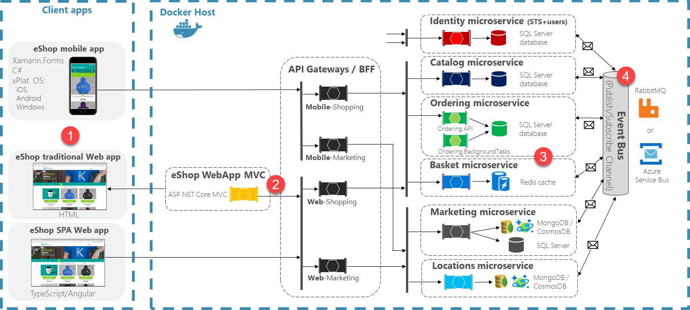
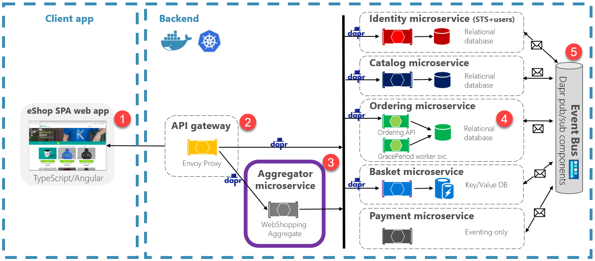

# Dapr reference application

Earlier in the book, you've learned about the foundational benefits of Dapr. You saw how Dapr can help your team construct distributed applications while reducing architectural and operational complexity. Along the way, you've had the opportunity to build some small Dapr apps. Now, it's time to explore an end-to-end microservice application that demonstrates  Dapr building blocks and components.

But, first a little history.

## eShop on Containers

Several years ago, Microsoft, in partnership with leading community experts, released a popular guidance book, entitled [.NET Microservices for Containerized .NET Applications](https://dotnet.microsoft.com/download/e-book/microservices-architecture/pdf). Figure 3-1 shows the book:

**Figure 3-1**. .NET Microservices: Architecture for Containerized .NET Applications.

The book dove deep into the principles, patterns, and best practices for building distributed applications. It included a full-featured microservice reference application that showcased the architectural concepts. Entitled, [eShopOnContainers](https://github.com/dotnet-architecture/eShopOnContainers), the application shows an eCommerce storefront that sells various .NET items, including clothing and coffee mugs.  Built in .NET Core, the application is cross-platform and can run in either Linux or Windows containers. Figure 3-2 shows the original eShop architecture.

**Figure 3-2**. Original `ShopOnContainers` reference application.

As you can see, eShopOnContainers includes many moving parts:

1. Three different front-end clients.
2. An application gateway to abstract the backend from the frontend.
3. Several backend core microservices.
4. An event bus component that enables asynchronous publish/subscribe messaging.

The eShopOnContainers reference application has been widely accepted across the .NET community and used to model many large commercial microservice applications.

## eShop on Dapr

A modernized version of the eShop application accompanies this book. It's called [eShopOnDapr](https://github.com/dotnet-architecture/eShopOnDapr). The updated reference application evolves (or, *Daprizes*, if you will) the earlier eShopOnContainers application by integrating Dapr building blocks and components. Figure 3-3 shows the new streamlined solution architecture:  

**Figure 3-3**. Modernized `eShopOnDapr` reference application.

 The application is simplified to keep the focus on Dapr integration:

1. The front end consists of a [Single Page Application](https://docs.microsoft.com/archive/msdn-magazine/2013/november/asp-net-single-page-applications-build-modern-responsive-web-apps-with-asp-net) written in the popular Angular SPA framework. It sends user requests to an API Gateway microservice.

2. The API Gateway abstracts the backend core microservices from the frontend client. It's implemented using [Envoy](https://www.envoyproxy.io/), a high performant, open-source service proxy. Envoy routes  incoming requests to various back-end microservices. Most requests are simple CRUD operations (for example, get the list of brands from the catalog) and handled by a direct call to a single back-end microservice.

3. Other requests from the api gateway are logically more complex and require multiple microservices to work together. For these cases, eShopOnDapr implements an [aggregator microservice](../cloud-native/service-to-service-communication#service-aggregator-pattern) that orchestrates a workflow across microservices required for the operation.

4. The set of core backend microservices includes functionality required for an online store. Each microservice is self-contained and independent of the others. Note how each microservice isolates a specific *business capability*:

      - The Identity microservice manages authentication and identity.
      - The Catalog microservice manages product items available for sale.
      - The Basket microservice manages the customer's shopping basket experience.
      - The Ordering microservice handles all aspects of placing and managing orders.
      - The Payment microservice transacts the customer's payment.

   Each service has its own persistent storage. Adhering to microservice [best practices](../cloud-native/distributed-data#database-per-microservice-why), there's not a shared datastore with which all services interact.

   The design of each microservice is based on its individual requirements. The simple services only require basic CRUD access to their underlying data stores. Advanced services, like Ordering, use a  Domain-Driven Design approach to manage business complexity. If necessary, services could also be built with different technology stacks: .NET Core, Java, Go, NodeJS, and more.

5. Finally, the event bus wraps the Dapr publish/subscribe components. It enables asynchronous publish/subscribe messaging across microservices. Developers can plug in any Dapr-supported message broker.

While Dapr is used throughout the eShopOn Dapr reference application, the following table highlight specific implementation examples:

|  Dapr building block | eShop microservice | Target class | Explanation
| :-------- | :-------- | :-------- | :-------- |
| State Management | | | Chapter 5 |
| Service-to-service invocation | Api Gateway | BasketService | Chapter 6 |
| Publish and Subscribe | Ordering | IntegrationEventController | Chapter 7 |
| Resource Binding | Ordering | SendEmailToCustomerWhenOrderStartedDomainEventHandler| Chapter 8 |
| Observability | | | Chapter 9 |
| Secrets | | | Chapter 10 |
| Actors | | | Chapter 11 |

[Hyperlink chapter explanations to the chapter]

## Benefits of applying Dapr to eShop

If you could overlay the updated eShopOnDapr over the original eShopOnContainers, you would see a streamlined application. Larges amounts of complex plumbing code would be abstracted away by the Dapr runtime.

Consider these improvements:

- Service Invocation
  - The original eShopOnContainers communicates across services with a mix of HTTP/REST and gRPC. eShopOnDapr replaces these calls with the Dapr service invocation building block. This solution provides a standardized approach for cross-service communication. Simplified gRPC support is available for any call while Dapr sidecars automatically communicate with gRPC. Sidecar-to-sidecar communication performance is especially critical as it crosses service boundaries. Other benefits include direct support for [mTLS](https://blog.cloudflare.com/introducing-tls-client-auth/) and automatic retries.

- Publish/Subscribe
  - eShopOnContainer includes extensive implementations for both the Azure Service Bus and Rabbit MQ. Developers used Service Bus for production and RabbitMQ for local development and testing. An `IEventBus` abstraction layer was created to enable swapping these message brokers. Implementing this layer required approximately *700 lines of highly complex code*.

        In the updated eShopOnDapr, a single implementation of `IEventBus` now uses the Dapr pub/sub building block to communicate with any Dapr supported message broker platform, which includes both Azure Service Bus and RabbitMQ. This implementation requires *35 lines of code*. That's a reduction of **95%**! Importantly, the updated Dapr implementation is straightforward and easy to understand. 

- Resource Binding
  - The eShopOnContainers solution contained a *to-do* item for e-mailing an order confirmation to the customer. With Dapr, implementing email notification was as easy as configuring a resource binding. There wasn't need to learn any external APIs or SDKs.

- State Management

  - Blah

- Observability
  - Blah

- Secrets
  - Blah

- Actors
  - Blah

// Extra content

   The earlier code required developers to construct a message handler pump for each broker.

   Part of the reason for this reduction is the integration with ASP.NET Core for subscribing to events. Instead of having to write a separate message handler loop for each message broker, we can use attributes on ordinary ASP.NET Core Controllers to subscribe to messages. This has the added benefit of having a single place where all external commands/events come in, whether it's via HTTP/REST, gRPC, or messaging. With Dapr, we now support many more pub/sub platforms in addition to Azure Service Bus and RabbitMQ, such as Redis Streams, Apache Kafka, and NATS.

- By using the service invocation and publish & subscribe building blocks, we've gained rich distributed tracing for both direct and pub/sub calls between services without having to write any code.

## Summary

### References

- [eShopOnDapr](https://github.com/dotnet-architecture/eShopOnDapr)

- [eShopOnContainers](https://github.com/dotnet-architecture/eShopOnContainers)

- [.NET Microservices for Containerized .NET Applications](https://dotnet.microsoft.com/download/e-book/microservices-architecture/pdf)

- [Architecting Cloud-Native .NET Apps for Azure](https://dotnet.microsoft.com/download/e-book/cloud-native-azure/pdf)

>[!div class="step-by-step"]
>[Previous](index.md)
>[Next](index.md)
