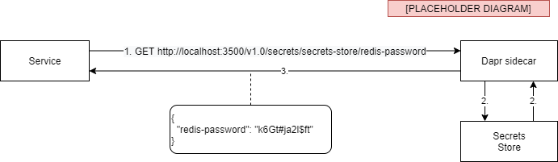

---
title: The Dapr secrets management building block
description: A description of the secrets management building block and how to apply it
author: edwinvw
ms.date: 12/20/2020

# The Dapr secrets management building block

In almost every application, you have to deal with information that you should not disclose because of security reasons. Here are some examples:

- a database connection-string that contains a username and password,
- an API key for calling an external RESTful API or
- a client certificate for authenticating to some external system.

Often, you make these values configurable so you can vary them per deployment environment. A popular way of doing this is to store them in an external settings file that will be read by the application at runtime. But how do you make sure you do not disclose the secrets in the settings file? A common mistake is pushing the settings file with the secrets to a public Git repository.

Dapr offers a secrets management building block that prevents this and significantly simplifies working with secrets.

## What it solves

A popular solution to working with secrets is using a secrets management tool like **Hashicorp Vault** or **Azure Key Vault**. These tools allow you to centrally store the actual secrets securely and reference them from your application. Access to the secrets is secured using some form of authentication and authorization, so only an application with sufficient rights can access them. When running your application in Kubernetes, you can also leverage its built-in secrets management mechanism.

It's great that these secrets management tools exist. But you need to know the differences between them. You are also required to learn all the specific APIs or SDKs they offer to use them from your code. This is where Dapr comes in.

The Dapr secrets management building block offers an abstraction for working with secrets. You can use the abstraction from your code. Hence, you do not need to learn how to interact with the different secrets management tools. This is all handled by Dapr.

## How it works

You can leverage the secrets management building block in two ways:

- Call it from your application code to retrieve a secret.
- Reference a secret from a Dapr component configuration.

We'll address referencing a secret from a Dapr component configuration later. First, we'll address calling the building block from your application code.

As with the other building blocks, the Dapr sidecar offers an API for you to interact with the secrets management building block. You can call this API using HTTP or gRPC. This is the URL of the API:

```http
http://localhost:<daprPort>/v1.0/secrets/<secret-store-name>/<name>?<metadata>
```

The URL contains the following segments:

- `<daprPort>` provides the port number upon which the Dapr sidecar is listening.
- `<secret-store-name>` provides the name of the selected Dapr secrets management component.
- `<name>` provides the name of the secret you want to retrieve.
- `<metadata>` provides metadata of the secret you want to retrieve. This is optional, and the available metadata properties will differ per secret store. See the [secrets management API reference]([Secrets API reference | Dapr Docs](https://docs.dapr.io/reference/api/secrets_api/)) for more information about the available metadata properties.

The JSON response you will receive contains the key and the value of the secret.

Here's an example of how Dapr handles a request on the secrets management API:



**Figure 10-1**. Retrieving a secret using the Dapr secrets management API

1. The service calls the Dapr secrets management API. It specifies the name of the secrets store and the name of the secret to retrieve.
2. The Dapr sidecar retrieves the specified secret from the secrets store.
3. The Dapr sidecar sends the secret information to the service.

Some secret stores support storing multiple key/value pairs in a secret. In that case, you receive all the keys and values in a single JSON response like in the following example:

```http
GET http://localhost:3500/v1.0/secrets/secrets-store/interestRates?metadata.version_id=3
```

```json
{
  "tier1-percentage": "2.5",
  "tier2-percentage": "3.8",
  "tier3-percentage": "5.1"
}
```

## Using the Dapr .NET SDK

Getting secrets using the Dapr .NET SDK is pretty straightforward. The `DaprClient` class offers a method `GetSecretAsync` for retrieving secrets using the secrets management building block. In the following code snippet, the connection string for connecting to a SQL Server database is retrieved:

```csharp
Dictionary<string, string> metadata = new Dictionary<string, string> { { "version_id", "3" } };
Dictionary<string,string> secrets = await daprClient.GetSecretAsync("secrets-store", "eshopsecrets", metadata);
string connectionString = secrets["customerdb"];
```

You need to specify the name of the secret store component to use and the name of the secret you want to retrieve. The metadata is optional and differs per secret store. Notice that you always receive a dictionary as result. This is because some secret stores support storing multiple key/value pairs in a secret. In the example, we extract the secret named `customerdb` to get the connection-string.

The .NET SDK also offers a .NET configuration provider for working with secrets. The provider is available in the *Dapr.Extensions.Configuration* NuGet package. In the following code snippet, you see an example of registering the secrets configuration provider in the `Program.cs` of an ASP.NET Web API application:  

```csharp
public static IHostBuilder CreateHostBuilder(string[] args) =>
    Host.CreateDefaultBuilder(args)
        .ConfigureAppConfiguration(config =>
        {
            var daprClient = new DaprClientBuilder().Build();
            var secretDescriptors = new List<DaprSecretDescriptor>
            {
                new DaprSecretDescriptor("eshopsecrets")
            };
            config.AddDaprSecretStore("secrets-store", secretDescriptors, daprClient);
        })
        .ConfigureWebHostDefaults(webBuilder =>
        {
            webBuilder.UseStartup<Startup>();
        });
```

You need to specify a `DaprClient` when registering the provider. The client is used to invoke the secrets API on the Dapr sidecar of the application. You also need to specify the name of the secrets management component to use. Finally, you have to specify which secrets to retrieve by passing in a list of `DaprSecretDescriptor` instances. A `DaprSecretDescriptor` contains a secret name and optionally a dictionary containing secret metadata.

Once this configuration provider is registered, it will retrieve the specified secrets and add them to the .NET configuration. Now you're able to get them in your application code:

```csharp
public void GetCustomer(IConfiguration config)
{
    var connectionString = config["eshopsecrets"]["customerdb"];
}
```

## Secrets management components

Several Dapr components exist for implementing the Secrets Management building block. Each component uses a particular secret store. At the time of writing, Dapr supports the following set of secret stores:

- Environment Variables
- Local file
- Kubernetes secrets
- AWS Secrets Manager
- Azure Key Vault
- GCP Secret Manager
- HashiCorp Vault

> The environment variables and local file components are only meant for development and not for production workloads.

The following section will show how to configure a secrets management component for your application.

### Configuration (TODO Move generic text to getting started)

You configure a Secrets Management component using a Dapr configuration file. Here you see the structure of a config file:

```yaml
apiVersion: dapr.io/v1alpha1
kind: Component
metadata:
  name: [component name]
  namespace: [namespace]
spec:
  type: secretstores.[secret store type]
  version: v1
  metadata:
  - name: [property name]
    value: [property value]
```

As with all the Dapr configuration files, you specify a `name` and `namespace` for the component. You specify the actual secret store to use using the `type` field of the `metadata` section. The properties you specify in the `metadata` section differ per secret store. Once you have configured the secrets management component, you can use the Dapr Secrets Management API to retrieve secrets from your application code.

As stated before, another way of using secrets is by referencing them from other component configuration files. We'll demonstrate this with a state management component (see the State Management building block chapter for more information). We'll use a Redis cache state component. The configuration for this component might look like this:

```yaml
apiVersion: dapr.io/v1alpha1
kind: Component
metadata:
  name: eshop-basket-statestore
  namespace: eshop
spec:
  type: state.redis
  metadata:
  - name: redisHost
    value: localhost:6379
  - name: redisPassword
    value: e$h0p0nD@pr
```

Notice the clear-text password for connecting to the Redis server in this configuration file. This is not a secure way of dealing with a password. If you were to push this config file to a public Github repo for instance, you have disclosed the password. To make this more secure, we could store the password in a secret store. We will show how to do this with a couple of examples.

### Local file

In the first example, we will use the local file component. As stated, this is only suitable for development scenarios. First, we create a JSON file named `eshop-secrets.json` that contains the secrets. Here's an example:

```json
{
  "eShopRedisPassword": "e$h0p0nD@pr"
}
```

We place this file in the Dapr components folder that we will use when we run our application with Dapr.

Next, we create a Secrets Management component configuration file that uses a local file as secret store in the same components folder:

```yaml
apiVersion: dapr.io/v1alpha1
kind: Component
metadata:
  name: eshop-local-secret-store
  namespace: eshop
spec:
  type: secretstores.local.file
  version: v1
  metadata:
  - name: secretsFile
    value: ./components/eshop-secrets.json
  - name: nestedSeparator
    value: ":"
```

Notice that the type of the component is `secretstore.local.file` and the file-name of the secrets file in the metadata. You can specify the path to the secrets file as an absolute path or a relative path. When using a relative path, you must specify it relative to the folder from where you will start the application. In this example, the `components` folder is a sub-folder of the folder that contains a .NET application. When starting the application with Dapr in stand-alone mode, you do this from the application folder and specify the components path on the command-line:

```bash
dapr run --app-id basket-api --components-path ./components dotnet run
```

This only works like this when running Dapr in stand-alone mode. For other hosting options, you should use a different mechanism to give Dapr access to the secrets file (e.g. volume mounts when hosting in Kubernetes).

Also, notice the `nestedSeparator` in the config file. The component uses the character you specify here to flatten the JSON hierarchy in the secrets file (if present). Imagine using the following JSON secrets file:

```json
{
    "redisPassword": "some password",
    "connectionStrings": {
        "customerdb": "some connection string",
        "productdb": "some connection string"
    }
}
```

With a colon as separator, you can then get at the value of the customerdb connection-string using the key `connectionStrings:customerdb`. The colon is the default separator (also when nothing is specified).

Now that we have configured the secrets management component, we can use it in the State Management configuration file:

```yaml
apiVersion: dapr.io/v1alpha1
kind: Component
metadata:
  name: eshop-basket-statestore
  namespace: eshop
spec:
  type: state.redis
  metadata:
  - name: redisHost
    value: localhost:6379
  - name: redisPassword
    secretKeyRef:
      name: eShopRedisPassword
      key: eShopRedisPassword
auth:
  secretStore: eshop-local-secret-store
```

Notice that we use a `secretKeyRef` instead of a literal value for the password. We specify the name of the component to use and the name and key of the secret, in this case: `eshop-local-secret-store` and `eShopRedisPassword` respectively. Using the `auth` metadata section, we specify the secrets management component to use, in this case: `eshop-local-secret-store`.

You might wonder why `eShopRedisPassword` is used both for the name as well as for the key in the secret reference. This is because the secrets are not identified by a separate name when using the local file secret store. This is different in the next example, where we use Kubernetes secrets.

### Kubernetes secret

For this second example, we will assume the application is running in Kubernetes. We'll use the built-in secrets mechanism in Kubernetes for storing the secret. First, we use the Kubernetes CLI to create a secret named `eshop-redis-secret` that contains the password:

```bash
kubectl create secret generic eshopsecrets --from-literal=redisPassword=e$h0p0nD@pr
```

Now we can use this secret in the State Management configuration file:

```yaml
apiVersion: dapr.io/v1alpha1
kind: Component
metadata:
  name: eshop-basket-statestore
  namespace: eshop
spec:
  type: state.redis
  metadata:
  - name: redisHost
    value: redis:6379
  - name: redisPassword
    secretKeyRef:
      name: eshopsecrets
      key: redisPassword
auth:
  secretStore: kubernetes
```

Notice that we use a `secretKeyRef` instead of a literal value for the password. We specify the name of the Kubernetes secret to use and the secret's key, in this case: `eshopsecrets` and `redisPassword` respectively. Using the `auth` metadata section, we specify the secrets management component to use, in this case: Kubernetes. This is the default by the way, so you can omit this part when using Kubernetes secrets.

In a production setting, you would never create the secret as we did in the example. Typically, secrets are created as part of some automated CI/CD pipeline. This ensures that only people with sufficient access to this pipeline can access and change the secrets. Developers creating Dapr configuration files for deploying an application can then reference the secrets without knowing the actual values.

### Azure Key Vault

The next example will be a bit more elaborate and more geared toward a production scenario. We'll use **Azure Key Vault** as the secret store. Azure Key Vault is an Azure service that allows you to store secrets in the cloud securely.

For this example we will assume that the following prerequisites are already satisfied:

- You have administrative access to an Azure subscription.
- An Azure Key Vault named `eshopkv` already exists that holds a secret named `redisPassword` containing the password for the Redis cache.
- A service principal is created. A service principal is an identity that can be used by applications to authenticate against certain Azure services. A service principal can be setup with a X509 certificate. The application can use this certificate as a credential to authenticate itself.
- The X509 certificate for this service principal (containing both the public and private key) is downloaded and available as a `.pfx` file on our local filesystem.

Check out the [Dapr Azure Key Vault secret store documentation](https://docs.dapr.io/operations/components/setup-secret-store/supported-secret-stores/azure-keyvault/) for instructions on how to set this up.

To use the Azure Key Vault as the secret store from eShop, we must create a component configuration file.

#### Running in stand-alone mode

When running the application with Dapr in stand-alone mode, the configuration file looks like this:

```yaml
apiVersion: dapr.io/v1alpha1
kind: Component
metadata:
  name: eshop-azurekv-secret-store
  namespace: eshop
spec:
  type: secretstores.azure.keyvault
  version: v1
  metadata:
  - name: vaultName
    value: eshopkv
  - name: spnTenantId
    value: "619926af-a7c3-4e95-93ed-4ecc4e3e652b"
  - name: spnClientId
    value: "6cf48032-6c38-43be-9d6f-2a43ce736b09"
  - name: spnCertificateFile
    value : "azurekv-spn-cert.pfx"
```

Notice the type of the secrets management component is `secretstores.azure.keyvault`. Also notice the metadata that contains the following properties:

- The `vaultName` must contain the name of the Azure Key Vault.
- The `spnTenantId` must contain the tenant id of the service principal used to authenticate against the Key Vault.
- The `spnClientId` must contain the app id of the service principal used to authenticate against the Key Vault.
- The `spnCertificateFile` must contain the path to the certificate file for the service principal used to authenticate against the Key Vault.

> You can retrieve all the necessary information of the service principal using the Azure CLI or using the Azure portal.

Now the eShop services can retrieve the Redis password from the Azure Key Vault.

#### Running on Kubernetes

When running your application with Dapr on Kubernetes, you can also use the service principal to authenticate against the Azure Key Vault. You can create a Kubernetes secret that contains the certificate file using the Kubernetes CLI tool:

```bash
kubectl create secret generic [k8s_spn_secret_name] --from-file=[pfx_certificate_file_local_path]
```

You have to specify the following command-line arguments:

- `[k8s_spn_secret_name]` is secret name in Kubernetes secret store.
- `[pfx_certificate_file_local_path]` is the path of X509 certificate file you downloaded above.

Once the Kubernetes secret is created, you can reference this in the secrets management component configuration file:

```yaml
apiVersion: dapr.io/v1alpha1
kind: Component
metadata:
  name: eshop-azurekv-secret-store
  namespace: eshop
spec:
  type: secretstores.azure.keyvault
  version: v1
  metadata:
  - name: vaultName
    value: [your_keyvault_name]
  - name: spnTenantId
    value: "619926af-a7c3-4e95-93ed-4ecc4e3e652b"
  - name: spnClientId
    value: "6cf48032-6c38-43be-9d6f-2a43ce736b09"
  - name: spnCertificate
    secretKeyRef:
      name: [k8s_spn_secret_name]
      key: [pfx_certificate_file_local_name]
auth:
    secretStore: kubernetes
```

Now the eShop services running in Kubernetes can retrieve the Redis password from the Azure Key Vault.

> [!IMPORTANT]
> It is crucial to keep the file containing the public and private key-pair for the X509 certificate of the service principal in a safe place. One way of doing this, is to make sure you place the file in a well-known folder outside the source-code repository. This well-known folder can then be used in the configuration file. On your local dev machine, you place the certificate in this folder. On the machine where the application will be deployed, the certificate is placed in this folder by an automated deployment pipeline. Also, it is a best practice to use a different service principal per environment. This ensures that the service principal used by the developers in the DEV environment cannot be used to access secrets for the PRODUCTION environment.

### Scoping secrets

Secret scopes allow you to control which secrets your application can access. You configure this in the Dapr sidecar configuration you can specify when running your application with Dapr. See [Dapr sidecar configuration documentation](https://v1-rc2.docs.dapr.io/operations/configuration/configuration-overview/) for instructions on how to specify a configuration file when starting an application.

Here's an example of a Dapr sidecar configuration file that contains secret scopes:

```yml
apiVersion: dapr.io/v1alpha1
kind: Configuration
metadata:
  name: dapr-config
  namespace: eshop
spec:
  tracing:
    samplingRate: "1"
  secrets:
    scopes:
      - storeName: eshop-azurekv-secret-store
        defaultAccess: allow
        deniedSecrets: ["redisPassword", "apiKey"]
```

You specify the scopes per secret store (in the example, this is `eshop-azurekv-secret-store`). You configure access to secrets using the following properties:

| Property         | Value               | Description                                                  |
| ---------------- | ------------------- | ------------------------------------------------------------ |
| `defaultAccess`  | `allow` or `deny`   | Allows or denies access to all secrets in the specified secret store. This property is optional end the default value is `allow`. |
| `allowedSecrets` | List of secret keys | Secrets specified in the array will be accessible. This property is optional. |
| `deniedSecrets`  | List of secret keys | Secrets specified in the array will NOT be accessible. This property is optional. |

The `allowedSecrets` and `deniedSecrets` properties take precedence over the `defaultAccess` property. Imagine you specify `defaultAccess: allowed` and specify an `allowedSecrets` list. In that case, only the secrets in the `allowedSecrets` list are accessible by the application.

## Reference architecture: eShopOnDapr

In eShopOnDapr, we use the secrets management building block for managing two secrets:

- the password for connecting to the Redis cache and
- the API-key for using the Twilio Sendgrid API. We use this to send emails using a Dapr output binding (as described in the [Bindings building block chapter](bindings-buildingblock.md)).

When running the application using Docker Compose, we use the **local file** secrets management component. In the `dapr/components` folder of the eShopOnDapr repository, you find configuration file `eshop-secretstore.yaml`. It configures the local file secrets store component:

```yaml
apiVersion: dapr.io/v1alpha1
kind: Component
metadata:
  name: eshop-secretstore
  namespace: default
spec:
  type: secretstores.local.file
  metadata:
  - name: secretsFile
    value: ./components/eshop-secretstore.json
```

This configuration references the local file `eshop-secretstore.json` in the same folder:

```json
{
    "redisPassword": "**********",
    "sendgridAPIKey": "**********"
}
```

The components folder is mounted as a local folder inside the Dapr sidecar container and specified in the command-line when starting it. Here you see a snippet from the `docker-compose.override.yml` file in the root of the repository:

```yaml
  ordering-backgroundtasks-dapr:
    command: ["./daprd",
      "-app-id", "ordering-backgroundtasks",
      "-app-port", "80",
      "-dapr-grpc-port", "50004",
      "-components-path", "/components",
      "-config", "/configuration/eshop-config.yaml"
      ]
    volumes:
      - "./dapr/components/:/components"
      - "./dapr/configuration/:/configuration"
```

Notice the `/components`  volume mount and the `--components-path` command-line argument passed in the `daprd` startup command.

The secrets are referenced from other component configuration files. Here's an example of the configuration for the Publish/Subscribe component used in eShopOnDapr:

```yaml
apiVersion: dapr.io/v1alpha1
kind: Component
metadata:
  name: pubsub
  namespace: default
spec:
  type: pubsub.redis
  metadata:
  - name: redisHost
    value: redis:6379
  - name: redisPassword
    secretKeyRef:
      name: redisPassword
auth:
  secretStore: eshop-secretstore
```

## Summary

The Dapr Secrets Management building block provides the capability of storing and retrieving sensitive configuration settings like passwords and connection-strings. This prevents you from accidentally disclosing these by pushing them to a public repo for instance.

The building block supports several different secret stores and hides their complexity by making them available through the Dapr secrets management API.

The `DaprClient` in the Dapr .NET SDK provides a method to retrieve secrets. There is also a .NET configuration provider that retrieves secrets upon application startup using the secrets management API. It makes the secrets available as configuration values you can use in your .NET code.

You can retrieve secrets in your application code or reference them from other Dapr component configuration files.

You can use secret scopes to control access to specific secrets.

### References

>[!div class="step-by-step"]
>[Previous](observability.md)
>[Next](actors.md)
