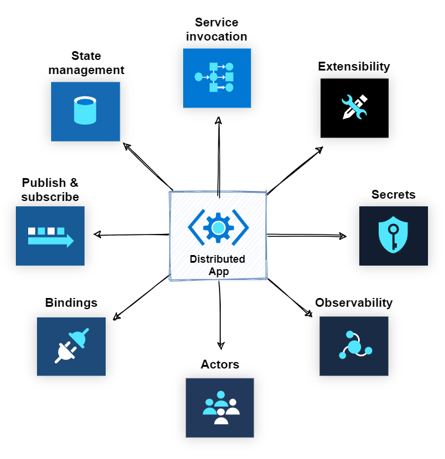
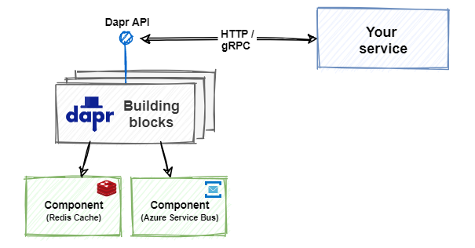

# Summary

We're at the end of our Dapr flight. The jet plane flying at 20,000 feet from [chapter 2](dapr-at-20000-feet.md) is on final approach and about to land.

As the plane taxis to the gate, let's take a minute to review some important conclusions from this guide:

- **Dapr** - Dapr is a *Distributed Application Runtime* that streamlines how distributed applications are built. Through an architecture of building blocks and pluggable components, Dapr hides the complexity of distributed application infrastructure. Instead of building plumbing, your team focuses on delivering business features to customers.

- **Open source and cross-platform** - The native Dapr API can be consumed by *any platform* that supports HTTP or gRPC. Dapr also provides language-specific SDKs for popular development platforms. Dapr v1.0 supports Go, Python, .NET, Java, PHP, and JavaScript.

- **Building blocks** - Dapr building blocks encapsulate distributed application functionality. At the time of this writing, Dapr supports the seven building blocks shown in figure 11-1.

**Figure 11-1**. Dapr building blocks.

- **Components** - Dapr components provide the concrete implementation for each Dapr building block capability. They expose a common interface that enables developers to swap out component implementations without changing application code. Figure 11-2 shows the relationship among components, building blocks, and your service.

**Figure 11-2**. Dapr building block integration.

- **Sidecars** - Dapr runs alongside your application in a sidecar architecture, either as a separate process of a container. Your application communicates with the Dapr APIs over HTTP and gRPC. Sidecars provide isolation and encapsulation as they aren't part of the service, but connected to it. Figure 11-3 shows a sidecar architecture.

**Figure 11-3**. Sidecar architecture.

- **Hosting environments** Dapr has cross-platform support and can run in multiple environments. At the time of this writing, the environments include a local self-hosted mode and Kubernetes.

- **eShopOnDapr** - This book includes an accompanying reference application entitled [eShopOnDapr](https://github.com/dotnet-architecture/eShopOnDapr). Using a popular ecommerce application domain, the reference application demonstrates the usage of each building block. It's an evolution of the widely popular [eShopOnContainers](https://github.com/dotnet-architecture/eShopOnContainers), released several years ago.

## The road ahead

Looking forward, Dapr has the potential to have a profound impact on distributed application development. What can you expect from the Dapr team and its open-source contributors?

At the time of writing, the list of proposed enhancements for Dapr include:

- Feature enhancements to existing building blocks:
  - Query capabilities in state management enabling you to retrieve multiple values.
  - Topic filtering in pub/sub enabling you to filter topics based on their content.
  - An application tracing API in observability that provides tracing in the application directly without having to bind to specific libraries.
  - Binding and pub/sub support for actors providing event driven capabilities to the actor programming model. Bound components will trigger events and messages invoke methods in the actor.

- New building blocks:
  - Configuration API building block for reading and writing configuration data. The block will bind to providers that include Azure Configuration Manager or GCP Configuration Management.
  - Http scale-to-zero autoscale.
  - Leader election building block to provide singleton instances and locking semantic capabilities.
  - Transparent proxying building block for service invocation, enabling you to route messages based on URLs or DNS addresses at the network level.
  - Resiliency building block (circuit breakers, bulkheads & timeouts).

- Integration with frameworks and cloud native technologies. Some examples include:
  - Django
  - Nodejs
  - Express
  - Kyma
  - Midway

- New language SDKs:
  - JavaScript
  - RUST
  - C++

- New hosting platforms:
  - VMs
  - Azure IoT Edge
  - Azure Stack Edge
  - Azure Service Fabric

- Developer and operator productivity tooling:
  - VS Code extension.
  - Remote Dev Containers for local debugging a DevOps pipeline development.
  - Dapr operational dashboard enhancements that will provide deeper visibility into the operational concerns of managing Dapr applications.

Dapr version 1.0 will provide developers with a compelling toolbox for building distributed applications. As the proposed enhancement list shows, Dapr is under active development with many new capabilities to come. Stay tuned to the [Dapr site](https://dapr.io/) and [Dapr announcement blog](https://cloudblogs.microsoft.com/opensource/2019/10/16/announcing-dapr-open-source-project-build-microservice-applications/) for future updates.

>[!div class="step-by-step"]
>[Previous](secrets.md)
